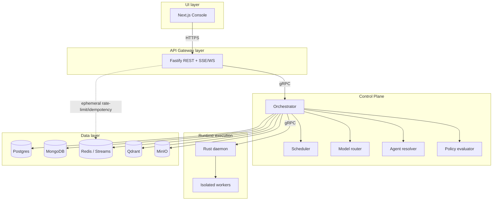
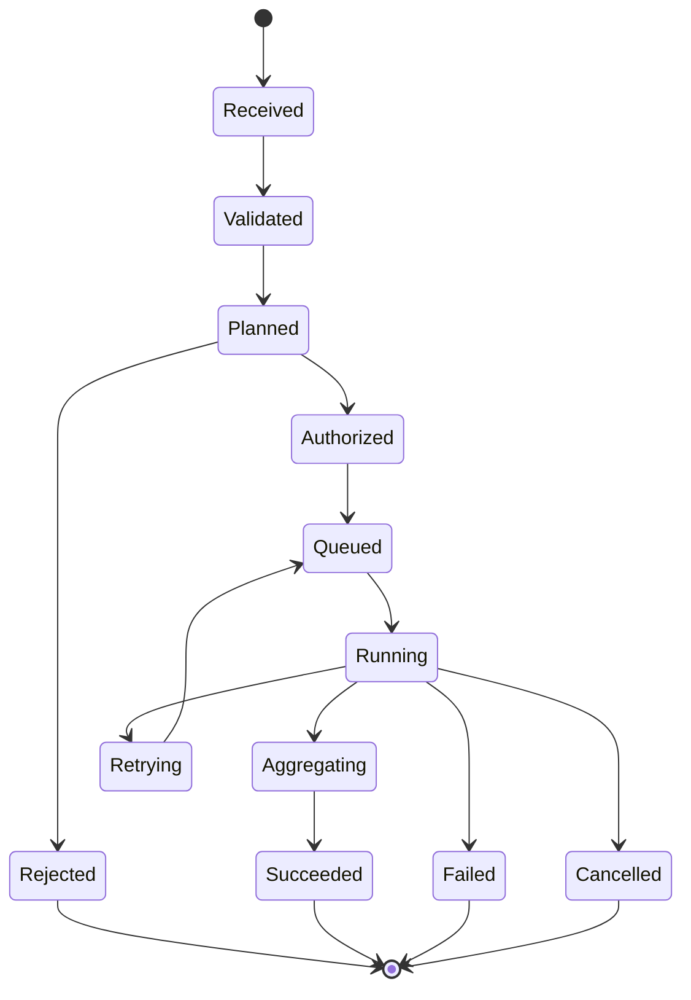

# OMERTAOS technical architecture

**Document role:** normative reference architecture with explicit design
targets. The canonical ownership and selected dependency boundaries are
repository-verified; lifecycle, security, observability, and distributed-system
properties are not all implemented end to end. Consult the
[claim ledger](docs/research/evidence-and-claims.md) before treating a section
as empirical evidence.

## Reading convention

- **Enforced boundary:** backed by a current architecture test or static gate.
- **Implemented prototype:** source exists, but deployment acceptance may still
  be incomplete.
- **Design target:** required behavior for future implementation and
  experiments.

Unless a section says otherwise, diagrams describe the intended complete
architecture rather than a production-readiness claim.

## Layer model



The UI owns presentation and never holds infrastructure credentials. The Gateway is the external trust boundary: it authenticates, authorizes coarse API actions, validates schemas, limits traffic, assigns request identity, and translates HTTP streams. The Control Plane owns durable task state and all decisions. The Rust Runtime owns privileged side effects and sandbox enforcement. The Data Layer exposes typed adapters; databases are not shared implementation APIs.

## Enforced dependency contract

```text
Browser / Console server
        |
        v
Gateway public HTTP/stream API
        |
        v
Control versioned HTTP/gRPC API
        |
        v
Runtime Daemon versioned gRPC API
```

- Console does not resolve Control or Runtime endpoints and never imports their
  clients. Console health and administration requests also pass through Gateway.
- Gateway does not import `data/`, `database/`, `db/`, ORM clients or domain
  repositories. Redis is limited to ephemeral admission concerns such as rate
  limiting and idempotency; it is not a domain system of record.
- Control owns planning and durable transitions but uses `data/` interfaces for
  persistence. It cannot import or invoke subprocess/shell/host-execution APIs.
- Runtime receives an authorized, bounded execution request and performs all
  process, filesystem, network, sandbox and resource side effects.
- Versioned source contracts are authored only in `schemas/v1/`; generated
  clients are consumed from `shared/generated/`.

Architecture CI checks canonical ownership, forbidden imports, presentation
bypasses, subprocess boundaries, and migration completion. The Structure S6
snapshot records that repository-owned gates passed at that commit; Runtime
compilation was separately blocked by dependency resolution. Current results
must always be established by rerunning `tests/architecture/` and the Runtime
tests on the evaluated commit.

## Protocols

| Protocol | Use | Constraint |
|---|---|---|
| REST/JSON | External CRUD, task submission, health | Versioned `/v1`; bounded payloads and idempotency keys |
| SSE | Ordered one-way task progress | Resume with event ID; heartbeat and bounded replay |
| WebSocket | Bidirectional interactive sessions | Authenticated upgrade, per-message limits, backpressure |
| gRPC/Protobuf | Gateway–Control and Control–Runtime | Deadlines, mTLS in production, compatible versioned contracts |
| Event bus | Lifecycle, audit, telemetry and integration facts | Redis Streams default; Kafka for partitions/retention/scale |

## Task lifecycle



This is the target lifecycle. Submission creates a task and outbox record
atomically. Planning resolves an agent and decomposes work. Policy evaluation
returns `allow`, `deny`, or `modify`; only an allowed, possibly narrowed plan
is queued. The scheduler leases a job. Runtime verifies its capability grant,
creates the sandbox, executes, and streams events. Control deduplicates events,
aggregates outputs, persists terminal state, and stores large artifacts in
MinIO. Individual stages require implementation and end-to-end evidence before
they can be reported as validated behavior.

## Agent selection and model routing

Agent candidates must match required skills, schema version, tenant visibility, enabled state, health, and policy. Selection then considers locality, current leases, historical reliability, and declared resource bounds. The selected immutable agent version is recorded on the task.

Model routing first applies hard constraints: modality, context/token limits, tool/function support, data residency, provider allowlist, safety classification, availability, and budget ceiling. It then scores eligible versions by task-quality profile, predicted latency, normalized cost, health, and load. A route records the rule version and score inputs. Retries may use a declared fallback chain but cannot weaken policy or residency constraints. Circuit-breaker-open providers are excluded.

## Retrieval and Qdrant

Documents enter through a versioned ingestion pipeline: authorize → normalize → chunk → redact/classify → embed → upsert vectors and payload metadata. Qdrant stores embeddings and filterable references, not canonical documents. Query embeddings use the same model/version and distance metric as the collection; tenant and ACL filters are mandatory. Control retrieves top-k candidates, optionally reranks them, fetches source content through the Data Layer, and records provenance. Postgres stores ingestion metadata; MinIO stores large source objects.

## Event-driven consistency

Services publish events through a transactional outbox where state and event must agree. Consumers use stable event IDs, consumer groups, idempotent handlers, bounded retries, and dead-letter streams/topics. Ordering is guaranteed only within the task partition. Schema versions are explicit; consumers ignore additive unknown fields. Redis Streams is the operational default; Kafka is selected when independent retention, replay volume, or partition throughput requires it.

## Failure handling

- Every network operation has a deadline; retries use exponential backoff with jitter and a maximum attempt/elapsed-time budget.
- Retry only transient, idempotent operations. Submission and dispatch use idempotency keys; Runtime execution requires a unique attempt ID and lease fencing token.
- Circuit breakers protect Control, model providers, and storage dependencies. Bulkheads isolate tenants, providers, and worker pools.
- Lost workers cause lease expiry and rescheduling only when the action is retry-safe. Unknown side-effect status requires reconciliation, not blind retry.
- Poison events move to a dead-letter destination with reason, payload reference, and correlation ID.
- Cancellation is cooperative first, then enforced at the sandbox boundary; terminal states are monotonic.

## Observability

W3C trace context crosses HTTP, gRPC, event headers, and Runtime audit records. Spans include admission, policy, planning, model call, queue delay, sandbox startup, tool execution, and persistence without prompt/secret payloads. Structured logs include timestamp, service, version, tenant-safe identifier, trace ID, task ID, attempt ID, event, and outcome. Metrics cover request/error/latency, queue depth and age, state transitions, policy decisions, model tokens/cost, cache behavior, worker saturation, sandbox violations, and storage health. OpenTelemetry collectors export traces and metrics; audit records use a restricted, append-oriented sink with independent retention.

## Security boundaries

Identity is verified at Gateway and propagated as signed service claims. Control evaluates contextual policy and mints least-privilege capability grants. Runtime re-verifies grant signature, audience, expiry, task/attempt binding, executable/filesystem/network constraints, and resource ceilings. Network policy prevents bypass paths. Secrets are resolved at the consuming boundary, redacted from telemetry, and never embedded in tasks or events.

This paragraph defines the target security model. The current Runtime performs
named capability checks, but signature validation is minimal and Linux
namespace, mount, seccomp, and isolated-process backends remain fail-closed
stubs. Accordingly, this architecture document must not be cited as proof of
complete sandboxing, cryptographic grant enforcement, tenant isolation, or
production security.
