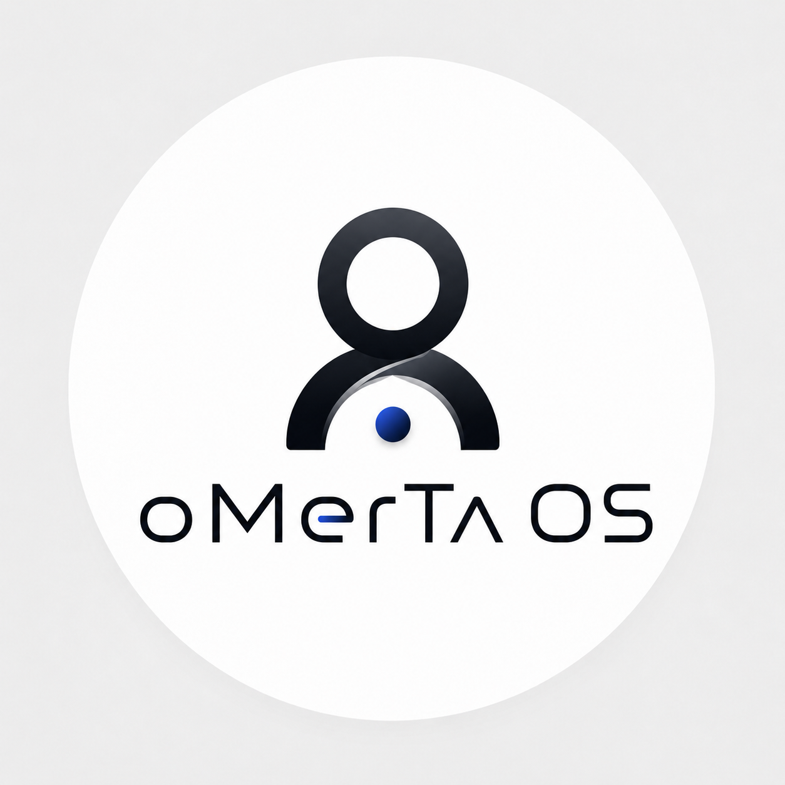
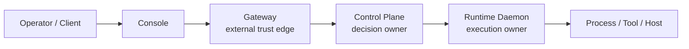
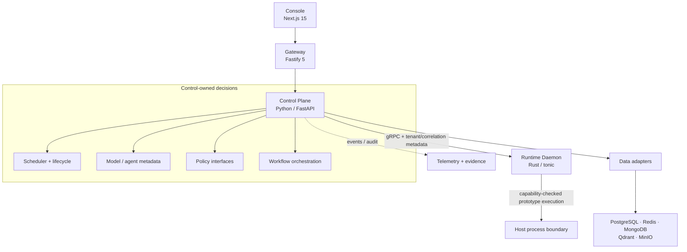

# OMERTAOS

<p align="center">
  
</p>

<p align="center">
  <strong>An open, modular Agent Operating System for governed AI execution</strong>
</p>

<p align="center">
  Run agents across models, tools, data, and infrastructure with explicit
  boundaries for policy, execution, lifecycle, and audit context.
</p>

<p align="center">
  <a href="https://github.com/Hamedghz/OMERTAOS/actions/workflows/ci.yml"></a>
  <a href="LICENSE"></a>
  <a href="docs/research/evidence-and-claims.md"></a>
  
  
  
</p>

OMERTAOS is a system-software platform for coordinating AI agents while keeping privileged host execution behind a separate Runtime boundary. Its canonical request path is:

```text
Console -> Gateway -> Control Plane -> Runtime Daemon
```

The operator experience and high-level decisions live in TypeScript and Python. Execution is delegated over gRPC to a Rust daemon that checks explicit capabilities and carries tenant, request, attempt, and trace context into its audit events.

OMERTAOS is designed to complement agent frameworks—not replace their agent and workflow APIs. Its focus is the platform around agents: trust boundaries, registries, model routing, tenant-aware scheduling, policy, distributed contracts, infrastructure services, and reproducible evidence.

> **Maturity:** OMERTAOS is an active research and engineering prototype. The local Compose stack is executable and the canonical services build and test in CI. It is not production-qualified, security-certified, or evidence of large-scale performance.

## Why OMERTAOS?

Agent frameworks are excellent at defining agents, tools, graphs, and collaboration patterns. Operating those agents also requires trust boundaries, worker selection, host-effect ownership, tenant context, failure behavior, and honest evidence. OMERTAOS makes those concerns first-class.

| Concern | Typical agent-framework scope | OMERTAOS scope |
| --- | --- | --- |
| Agent and workflow definition | Primary concern | Integrates and orchestrates |
| External API trust boundary | Application-defined | Gateway-owned |
| Scheduling and lifecycle decisions | Varies | Control-owned |
| Privileged execution boundary | Varies or external | Rust Runtime-owned |
| Capability checks at execution | Varies | Named Runtime capabilities |
| Model metadata and routing | Often external | Registry + Control interfaces |
| Tenant-aware worker selection | Varies | Implemented prototype |
| Cross-service audit context | Application-defined | Propagated across Control/Runtime |
| Infrastructure and data services | External | Compose-integrated adapters/services |
| Production isolation and certification | Not implied | Explicitly not yet claimed |

This compares architectural scope, not framework quality. LangGraph, AutoGen, CrewAI, and similar tools can be used above or alongside OMERTAOS.

## What OMERTAOS is—and is not

| OMERTAOS is | OMERTAOS is not |
| --- | --- |
| A modular Agent OS architecture | Another LLM wrapper |
| A governed-execution reference implementation | A replacement for every agent framework |
| A control/runtime separation model | A completed Linux sandbox or mTLS deployment |
| An integration surface for models, policy, data, and events | A production-qualified or security-certified OS |
| A repository-verifiable research platform | Evidence of validated cluster-scale performance |

## Current capabilities

| Area | Available now |
| --- | --- |
| Execution | Rust tonic gRPC daemon, healthcheck, named capabilities, one allowlisted prototype intent |
| Scheduling | Tenant/capability-aware node selection, bounded retry/timeout, task-attempt records |
| Audit context | Tenant, request, attempt, correlation, and trace metadata at Runtime dispatch |
| Operator/API | Next.js 15 Console, Prisma bootstrap, Fastify 5 Gateway, Python/FastAPI Control |
| Data/contracts | Versioned schemas/bindings, model profiles, data adapters, five local stores |
| Packaging | Four-service Docker Quickstart and optional proxy-router profile |
| CI evidence | Architecture/service tests, AMD64/ARM64 builds, security scans, SPDX SBOM |

These capabilities describe repository evidence, not production acceptance. See [Project maturity](#project-maturity) for the important boundaries.

## Quickstart

### Requirements

- Git;
- Docker Engine or Docker Desktop with Compose v2;
- free host ports `3000`, `8000`, `8080`, and loopback-only `50051`.

Clone the active integration branch:

```bash
git clone --branch CAPO --single-branch https://github.com/Hamedghz/OMERTAOS.git
cd OMERTAOS
```

Set the required local administrator credentials (the default password policy accepts 8–32 characters):

```bash
export CONSOLE_ADMIN_EMAIL="admin@example.com"
export CONSOLE_ADMIN_PASSWORD="ChangeThis123!"
```

Validate the resolved Compose model before creating containers:

```bash
docker compose \
  --project-directory . \
  -f deploy/docker/compose/quickstart.yml \
  config
```

Build and start the stack:

```bash
docker compose \
  --project-directory . \
  -f deploy/docker/compose/quickstart.yml \
  up --build -d
```

Check service state, then open `http://localhost:3000`:

```bash
docker compose --project-directory . \
  -f deploy/docker/compose/quickstart.yml ps
```

| Service | Local endpoint          | Exposure                     |
| ------- | ----------------------- | ---------------------------- |
| Console | `http://localhost:3000` | Browser UI                   |
| Gateway | `http://localhost:8080` | Public API boundary          |
| Control | `http://localhost:8000` | Loopback development API     |
| Runtime | `127.0.0.1:50051`       | Loopback gRPC                |

The stack also starts PostgreSQL, Redis, MongoDB, Qdrant, and MinIO internally. The one-shot `install` service applies Console migrations and seeds the admin.

> This is a development profile: Gateway authentication is disabled and secrets have placeholder defaults. Never expose it publicly or reuse its credentials.

Health checks and parallel-stack settings are in the [local Quickstart guide](docs/local-quickstart.md). Stop without deleting named volumes:

```bash
docker compose --project-directory . \
  -f deploy/docker/compose/quickstart.yml down
```

## Architecture

### Canonical request lifecycle



No canonical path allows the Console to call Control or Runtime directly, the Gateway to own domain persistence, or Control to perform host execution. Architecture tests check these ownership and dependency directions in the repository. This enforcement comes from source and CI checks; it does not imply that Git hosting branch-protection settings are enabled.

### Platform view



| Component | Canonical responsibility | Current implementation evidence |
| --- | --- | --- |
| `console/` | Operator presentation and workflows | Next.js app, Prisma bootstrap, unit/build configuration |
| `gateway/` | External transport, admission, and request context | Fastify service, tests, production build |
| `control/` | Orchestration, scheduling, policy decisions, lifecycle | Python services, APIs, gRPC adapters, targeted tests |
| `runtime-daemon/` | Capability checks and host execution boundary | Rust gRPC daemon, lite execution gate, fail-closed isolation stubs |
| `data/` | Persistence contracts and adapters | Canonical interfaces and adapter implementations |
| `registry/` | Versioned model and agent metadata ownership | Model profiles and Control registry API |
| `policies/` | Policy definitions and enforcement architecture | Policy assets/interfaces; complete grant protocol remains a target |
| `schemas/`, `shared/` | Versioned contracts and shared generated bindings | JSON schemas, protobuf, architecture checks |

The normative ownership rules are in [ARCHITECTURE.md](ARCHITECTURE.md),
[STRUCTURE.md](STRUCTURE.md), and
[ADR 0001](docs/adr/0001-canonical-aion-ownership.md). The current recovery
and validation references are the
[canonical design](docs/architecture/aion-canonical-design.md),
[capability recovery map](docs/migration/aion-capability-recovery.md), and
[S6 architecture validation](docs/migration/s6-architecture-validation.md).

## Security model

OMERTAOS uses layered ownership rather than treating a single service as the entire security boundary:

1. **Gateway** owns the external trust edge, authentication/admission metadata, CORS, and transport concerns.
2. **Control** owns contextual decisions, scheduling, tenant-aware lifecycle, and the request sent to Runtime.
3. **Runtime** validates required named capabilities and rejects tenant-context mismatches before command execution.
4. **Schemas and audit context** preserve identifiers needed to correlate a request, scheduling attempt, and Runtime outcome.

The `lite`/`personal` Runtime profile can execute the single allowlisted R5 command path used by the prototype. The `professional`/`enterprise` path still depends on namespace, mount, seccomp, and isolated-process backends that are not implemented; those paths fail closed. Capability-grant signature verification, production mTLS, complete sandbox isolation, formal verification, penetration testing, and security certification are not present claims.

For confidential vulnerability reports, use the process in [SECURITY.md](SECURITY.md), not a public issue.

## Technology stack

| Layer | Technology |
| --- | --- |
| Console | Next.js `15.5.21`, React 18, TypeScript, Prisma, pnpm 11 |
| Gateway | Fastify 5, TypeScript, Node.js |
| Control Plane | Python 3.11–3.12, FastAPI, SQLAlchemy, gRPC |
| Runtime | Rust 2021, Tokio, tonic/prost |
| Contracts | Protobuf, JSON Schema, Pydantic |
| Relational state | PostgreSQL 16 |
| Cache/coordination | Redis 7 |
| Document/vector/object services | MongoDB 7, Qdrant, MinIO |
| Local packaging | Docker Compose v2 |
| Desktop/bridge surfaces | Tauri 2 and the Windows agentic bridge |

Unpinned upstream images in development Compose files are not a production supply-chain policy. Review and pin deployment artifacts for any controlled environment.

## Project maturity

| Area | Status | Evidence boundary |
| --- | --- | --- |
| Canonical architecture contracts | Implemented + tested | Repository ownership tests |
| Console | Implemented prototype | Unit tests and production build in CI |
| Gateway | Implemented prototype | Build, tests, security middleware |
| Control Plane | Implemented prototype | Python tests and transport adapters |
| Runtime gRPC boundary | Implemented | Rust server, client, and tests |
| Allowlisted lite Runtime dispatch | Executable prototype | Control/Runtime code and targeted tests |
| Correlation-aware Runtime audit | Implemented prototype | gRPC metadata extraction and Rust tests |
| Docker Quickstart | Executable local prototype | Compose services, health gates, architecture tests |
| Linux namespace/cgroup/seccomp sandbox | In development | Incomplete isolation paths fail closed |
| Durable Runtime result replay | Not implemented | Restart-safe duplicate dispatch is blocked |
| Multi-node federation | Research/development | No production cluster acceptance claim |
| Production mTLS and signed grants | Not production-qualified | Architecture target only |
| Large-scale benchmarks | Not validated | No throughput/latency claim |
| Security certification | None | Independent review required |

For research work, the repository also uses three evidence levels:

- **E1 — repository-verified:** a current test or static gate checks the claim;
- **E2 — implemented prototype:** code and targeted checks exist, but complete system acceptance is limited;
- **E3 — design target:** a specified requirement or experiment without completed empirical validation.

The detailed exclusions and evidence map live in [Evidence and claims](docs/research/evidence-and-claims.md).

## Validation and CI

The primary workflow runs separate jobs for:

- canonical architecture contracts;
- Ruff and Rust Clippy with warnings denied;
- Python and Rust test suites;
- locked Rust release build and checksum artifact;
- Gateway, Console, and Windows bridge build/test checks;
- integration tests when the integration test directory is present;
- Bandit, Cargo Audit, and Trivy scans;
- Console, Control, Gateway, and Runtime container builds on AMD64 and ARM64;
- SPDX JSON SBOM generation.

Run the smallest relevant checks locally:

```bash
python -m pytest tests/architecture -q
npm run build --prefix gateway
npm test --prefix gateway
pnpm --dir console test --config vitest.config.mts
pnpm --dir console build
cargo fmt --check --manifest-path runtime-daemon/Cargo.toml
cargo test --locked --manifest-path runtime-daemon/Cargo.toml --all-targets
```

A green workflow is strong engineering evidence, not a security certificate, performance benchmark, or production service-level guarantee.

## Repository structure

```text
console/                         Operator UI
gateway/                         External API and trust boundary
control/                         Orchestration and decisions
runtime-daemon/                  Rust execution boundary
data/ · registry/ · policies/    Platform state and governance
schemas/ · shared/               Versioned contracts and bindings
integrations/ · deploy/          Adapters and packaging
tests/ · docs/                   Evidence and documentation
```

Legacy roots and compatibility paths remain migration inputs until their documented retirement gates pass. Their presence does not change canonical ownership.

## Development

Reference toolchains are Python 3.11, Node.js 20+, pnpm 11, Rust stable, and Docker Compose v2. Install only the parts you plan to change; the complete local setup and review rules are in [CONTRIBUTING.md](CONTRIBUTING.md).

Preserve the canonical path when adding functionality:

```text
Console -> Gateway -> Control -> Runtime Daemon
```

Changes to public APIs, schemas, authentication, Runtime isolation, or production topology require focused human review and corresponding tests.

## Roadmap

Near-term targets are complete Linux isolation; signed and bounded capability grants; durable restart-safe dispatch results; production mTLS and deployment hardening; multi-node membership/federation; reproducible failure, latency, throughput, and isolation benchmarks; and evidence-backed release gates.

Roadmap items are directions, not delivery commitments. Current evidence always takes precedence over architectural intent.

## Research

OMERTAOS is also the reference architecture investigated in the master's research:

> **OMERTAOS Architecture: A Modular Agent Operating System for Secure and Distributed Intelligent-Agent Infrastructure**

The research frames an Agent OS as a layer that coordinates agents, models, prompts, context, data, policy, and operational events across a distributed environment. The central architectural boundary is a Python Control Plane over a Rust Runtime execution boundary, supported by registries, workflows, scheduling, RPC/events, knowledge interfaces, policy, observability, and tenant context.

The reference implementation evaluates architectural feasibility and scenario-level behavior. It does not claim industrial benchmark results, production certification, or validated large-scale cluster performance.

Start with the [research package](docs/research/README.md), then use the [reproducibility guide](docs/research/reproducibility.md) and cite the exact commit evaluated.

## Documentation

Start with the [documentation map](docs/README.md), [technical architecture](ARCHITECTURE.md), [repository ownership](STRUCTURE.md), and [canonical design](docs/architecture/aion-canonical-design.md). Operator and component guides cover the [Quickstart](docs/local-quickstart.md), [Runtime](runtime-daemon/README.md), [Gateway](gateway/README.md), and [Control](control/README.md). Research and assurance material is indexed under [Research](docs/research/README.md), [Evidence and claims](docs/research/evidence-and-claims.md), and [Security](SECURITY.md).

## Contributing

Contributions are welcome. Please read [CONTRIBUTING.md](CONTRIBUTING.md) and [CODE_OF_CONDUCT.md](CODE_OF_CONDUCT.md) before opening a pull request. Keep changes focused, preserve canonical ownership, add positive and negative tests, and separate implemented evidence from future design.

## Citation

If OMERTAOS informs academic work, cite the software artifact and the exact commit evaluated. Machine-readable metadata is available in [CITATION.cff](CITATION.cff). No DOI is currently assigned.

```bibtex
@software{ghasemzadeh_omertaos_2026,
  author = {Hamed Ghasemzadeh},
  title  = {OMERTAOS},
  year   = {2026},
  url    = {https://github.com/Hamedghz/OMERTAOS},
  note   = {Research prototype; cite the evaluated commit}
}
```

## License

OMERTAOS is available under the [Apache License 2.0](LICENSE).

Human review is required before merge or production use. Do not infer security, performance, or operational qualification from a passing build alone.
