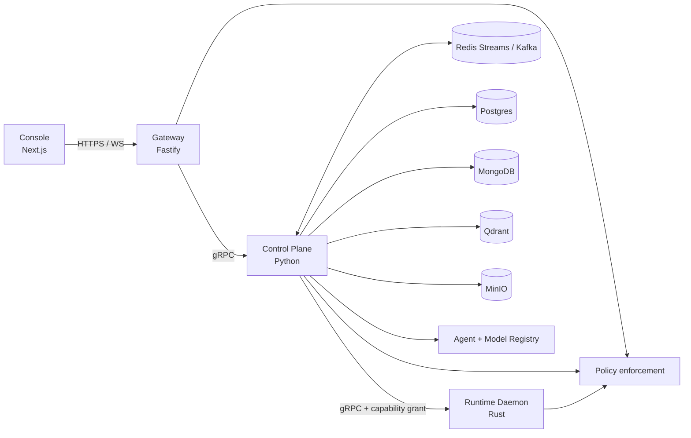

# OMERTAOS

OMERTAOS is a distributed AI operating system that separates user interaction, admission control, orchestration, and privileged execution. The architecture is layered for enforceable trust boundaries and event-driven for durable state propagation.

## Architecture



The synchronous request path is **Console → Gateway → Control Plane → Runtime Daemon**. The Gateway authenticates and validates requests; the Control Plane plans work, selects agents and models, evaluates policy, and issues a bounded execution grant; the Runtime Daemon enforces that grant inside an isolated sandbox. Lifecycle, audit, and telemetry events are emitted to Redis Streams by default or Kafka at larger scale. Clients observe progress over SSE or WebSocket rather than holding the execution RPC open.

## Agent and model execution

1. The Gateway assigns a correlation ID, authenticates the principal, enforces RBAC and rate limits, and submits a normalized task over gRPC.
2. The Control Plane persists the task, resolves an eligible agent by declared skills, version, health, tenant, and required capabilities, then produces a plan.
3. The policy engine evaluates principal, task, agent, resources, and environment. A denial terminates the task; a modification narrows the plan or capabilities.
4. Model routing filters registry entries by modality, context size, residency, policy, availability, and tool support, then scores cost, latency, quality, and load. Fallbacks remain within the allowed set.
5. The scheduler sends a job and signed, time-bounded capability grant to the Runtime Daemon. A worker creates the sandbox, executes commands/tools, streams audit records, and returns structured output.
6. The Control Plane aggregates results, stores artifacts in MinIO and metadata in the appropriate store, and publishes the terminal event.

## Repository map

| Path | Authority |
|---|---|
| `console/` | Next.js operator and user interface |
| `gateway/` | External API boundary and streaming transport |
| `control/` | Python orchestration and control APIs |
| `runtime-daemon/` | Rust execution and isolation boundary |
| `data/` | Database adapters, retrieval, and persistence contracts |
| `registry/` | Agent/model registry APIs and metadata |
| `policies/` | Authorization and capability policy definitions |
| `schemas/` | Versioned wire and event contracts |
| `shared/` | Generated clients and cross-language primitives |
| `deploy/` | Deployment manifests and operational scripts |

See [STRUCTURE.md](STRUCTURE.md) for ownership and migration rules and [ARCHITECTURE.md](ARCHITECTURE.md) for the detailed design.

## Quick start

Requirements: Docker Engine with Compose v2, 8 GB available RAM, and free ports 3000, 8000, and 8080.

```bash
cp .env.example .env
docker compose -f docker-compose.quickstart.yml up --build -d
docker compose -f docker-compose.quickstart.yml ps
```

Open `http://localhost:3000`. Quickstart credentials and tokens are development-only; replace every default before exposing a service. Stop with:

```bash
docker compose -f docker-compose.quickstart.yml down
```

### Desktop Shell

The optional Tauri Desktop Shell adds an OS-like native surface without replacing the Web Console or joining the Quickstart service graph. See [Desktop Shell](docs/desktop-shell.md) for prerequisites and run commands.

## Configuration

| Group | Representative variables | Purpose |
|---|---|---|
| Service endpoints | `AION_CONTROL_GRPC`, `AION_CONTROL_BASE_URL`, `NEXT_PUBLIC_GATEWAY_URL` | Internal service discovery and browser API URL |
| Gateway | `AION_GATEWAY_HOST`, `AION_GATEWAY_PORT`, `AION_REDIS_URL`, `AION_RATE_LIMIT_MAX`, `AION_IDEMPOTENCY_TTL` | Listener, cache, quotas, and replay control |
| Authentication | `AION_JWT_PUBLIC_KEY`, `AION_GATEWAY_API_KEYS`, `AION_GATEWAY_ADMIN_TOKEN` | Development credentials and JWT verification |
| TLS | `AION_TLS_REQUIRED`, `AION_TLS_REQUIRE_MTLS`, `AION_TLS_*_PEM` | Transport policy and certificate material |
| Control | `AION_CONTROL_*_DSN`, `TENANCY_MODE`, `AION_CONTROL_MODELS_DIRECTORY`, `AION_CONTROL_POLICIES_DIRECTORY` | Persistence, tenancy, and configuration roots |
| Objects/vectors | `AION_CONTROL_MINIO_*`, `AION_CONTROL_QDRANT_URL` | Artifact and embedding storage |
| Models | `ORCH_*`, `CODER_*`, provider-specific keys/endpoints | Model routing inputs |
| Telemetry | `AION_OTEL_ENABLED`, `AION_TELEMETRY_ENDPOINT`, `AION_METRICS_ENABLED` | Traces, metrics, and logs |

Use `.env.example` as the inventory. Store production secrets in an external secret provider; do not commit `.env`.

## Ports

| Port | Service | Exposure |
|---:|---|---|
| 3000 | Console HTTP | Host in quickstart |
| 8080 | Gateway HTTP, SSE, WebSocket | Host in quickstart |
| 8000 | Control Plane HTTP/health | Host in quickstart; restrict in production |
| 50051 | Control/runtime gRPC contracts | Internal network by default |
| 5432 | Postgres | Internal |
| 27017 | MongoDB | Internal |
| 6379 | Redis / Streams | Internal |
| 6333/6334 | Qdrant HTTP/gRPC | Internal |
| 9000/9001 | MinIO API/console | Internal |
| 4317/4318 | OpenTelemetry gRPC/HTTP | Internal when enabled |

## Security model

RBAC answers which API operations a principal may request. Policy evaluation adds tenant, resource, data-classification, network, model, and environment context. Capability-based access control then converts an allowed plan into least-privilege, short-lived grants enforced by the Runtime Daemon. The Gateway is the only public API; Console-to-Control and direct database access are prohibited. Production deployments require TLS, signed identity, non-default secrets, network policies, immutable audit events, sandbox resource limits, and explicit outbound-network capabilities.

## Documentation

- [Gateway](gateway/README.md) · [Control Plane](control/README.md) · [Runtime](runtime-daemon/README.md)
- [Data](data/README.md) · [Registry](registry/README.md) · [Policies](policies/README.md) · [Schemas](schemas/README.md)
- [Deployment](deploy/README.md) · [Tests](tests/README.md) · [Windows bridge](integrations/windows-agentic-bridge/README.md)
- [Desktop Shell](docs/desktop-shell.md)
