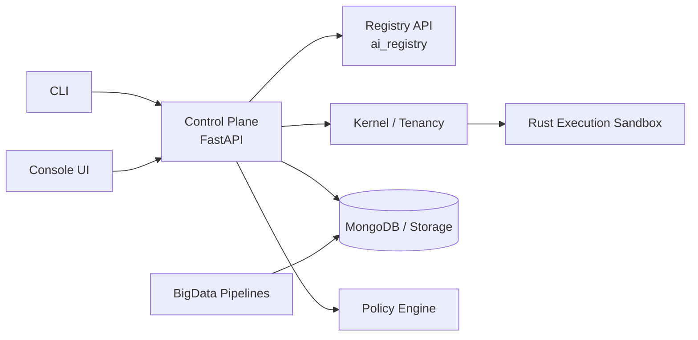

# OMERTAOS

OMERTAOS is an enterprise-grade distributed AI-agent platform that combines a FastAPI control plane, registry-driven model orchestration, Rust execution isolation, big-data pipelines, and a multi-tenant kernel runtime.

## Project Overview
OMERTAOS standardizes how autonomous agents are built, governed, deployed, and observed across development, staging, and production environments.

## Vision & Mission
- **Vision:** provide a secure operating substrate for scalable autonomous AI systems.
- **Mission:** unify control, execution, governance, and deployment under one consistent architecture.

## System Capabilities
- Async FastAPI control plane and orchestration APIs
- Registry-backed model and agent metadata resolution
- Rust execution sandbox for isolated module execution
- Multi-tenant kernel policy enforcement
- BigData pipelines for streaming and batch analytics
- CLI + Console interfaces for operators and developers
- Docker, Compose, and Helm deployment support

## High-Level Architecture Diagram


## Directory Structure (Canonical)
```text
/core /agents /control /registry /config /schemas /execution
/db /bigdata /cli /console /kernel /policies /shared
/deploy /tests /tools
```

## Key Components Overview
- **Control Plane:** API routing, orchestration, async workers.
- **Agents:** runtime agents and algorithm modules (including LSTM/GA surfaces).
- **Registry:** canonical metadata for models, agents, and locks.
- **Execution:** isolated Rust runtime modules.
- **Kernel:** multi-tenant runtime + policy enforcement.
- **BigData:** ETL/streaming and decision-support pipelines.

## Installation
See [docs/DEPLOYMENT.md](docs/DEPLOYMENT.md) and [docs/DEV_GUIDE.md](docs/DEV_GUIDE.md).

## Quick Start
```bash
git clone <repo-url>
cd OMERTAOS
# choose your flow
# docker compose / helm / native dev guide
```

## Example Agent Execution Flow
1. Control plane receives task request.
2. Registry resolves agent + model metadata.
3. Kernel applies tenancy and policy constraints.
4. Execution sandbox runs workload.
5. State and telemetry persist to DB/analytics layers.

## Deployment Overview
- Local/dev: Docker Compose
- Cluster/prod: Helm + Kubernetes
- Service hardening: policy bundles and environment-scoped config

## Documentation Links
- [Architecture](docs/ARCHITECTURE.md)
- [System Design](docs/SYSTEM_DESIGN.md)
- [Control Plane](docs/CONTROL_PLANE.md)
- [Registry System](docs/REGISTRY_SYSTEM.md)
- [Execution Sandbox](docs/EXECUTION_SANDBOX.md)
- [API Reference](docs/API_REFERENCE.md)
- [CLI Reference](docs/CLI_REFERENCE.md)
- [Deployment](docs/DEPLOYMENT.md)
- [Whitepaper](docs/WHITEPAPER.md)

## Research Context
OMERTAOS is designed to bridge production platform engineering with research workflows in agent orchestration, adaptive planning, policy-constrained autonomy, and scalable analytics.

## License
See [LICENSE](LICENSE) if present in your distribution, or your organizational licensing policy.
