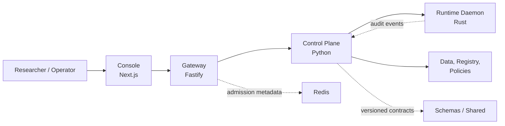

# OMERTAOS

**A modular system-software architecture for secure, governed, and observable
agentic-AI execution** [](https://github.com/Hamedghz/OMERTAOS/actions/workflows/ci.yml)
[](docs/research/evidence-and-claims.md)
<p align="center">
  
  
  
</p>

<p align="center">
  <a href="LICENSE">
    
  </a>
  
  
  
</p>

<p align="center">
  
  
  
  
  
  
</p>

<p align="center">
  
  
  
  
  
</p>

<p align="center">
  <a href="https://github.com/Hamedghz/OMERTAOS/actions/workflows/release.yml">
    
    

  </a>
</p>


OMERTAOS investigates how an agentic-AI platform can separate orchestration
decisions from privileged host execution. Its canonical request path is:

```text
Console -> Gateway -> Control -> Runtime Daemon
```

The repository combines a Next.js operator console, a Fastify API boundary, a
Python control plane, a Rust runtime daemon, versioned contracts, data adapters,
policy definitions, deployment assets, and architecture tests. The principal
research concern is not another agent framework; it is the system boundary that
governs *who may request an action, how that action is authorized, where it is
executed, and what evidence is retained*.

> **Project status.** OMERTAOS is an active research and engineering project
> that provides a modular reference architecture for secure, governed, and
> observable agentic-AI execution. The CAPO branch is the canonical integration
> branch, with repository-enforced ownership boundaries and continuously
> evolving runtime, isolation, distributed-systems, and validation capabilities.

## Research contribution

OMERTAOS is organized around four testable architectural propositions:

1. **Control/execution separation.** Planning, policy, scheduling, and durable
   state belong to Control; process and host side effects belong to Runtime.
2. **Policy-first execution.** External admission is enforced at Gateway, while
   contextual authorization is owned by Control and bounded capabilities are
   enforced at Runtime.
3. **Tenant-aware evidence.** Requests, decisions, execution attempts, and audit
   events carry identity and correlation context across service boundaries.
4. **Modular, versioned contracts.** REST, streaming, event, and gRPC contracts
   are versioned independently of service implementations.

The [research documentation](docs/research/README.md) maps these propositions
to repository evidence, limitations, reproducibility procedures, and the three
current manuscript tracks:

- system-software architecture;
- distributed runtime infrastructure and benchmark design;
- security-by-architecture and auditable execution.

These are manuscript themes, not publication or peer-review claims.

## Architecture at a glance



| Plane | Canonical responsibility | Current evidence |
|---|---|---|
| `console/` | Presentation and operator workflows | Source, unit-test configuration, production build path |
| `gateway/` | External trust boundary and transport | TypeScript implementation, tests, build path |
| `control/` | Orchestration, policy decisions, and durable lifecycle | Python implementation and targeted tests |
| `runtime-daemon/` | Privileged execution and capability enforcement | gRPC server and fail-closed migration tests; isolation backends remain incomplete |
| `data/`, `registry/`, `policies/` | Persistence, metadata, and policy ownership | Canonical interfaces and repository structure |
| `schemas/`, `shared/` | Versioned source contracts and generated bindings | Architecture ownership checks |

For normative boundaries, see [ARCHITECTURE.md](ARCHITECTURE.md),
[STRUCTURE.md](STRUCTURE.md), and
[ADR 0001](docs/adr/0001-canonical-aion-ownership.md).

## Evidence and maturity

The repository distinguishes implemented evidence from architectural intent:

| Evidence level | Meaning | Examples |
|---|---|---|
| **E1 — verified in repository** | A current test or static gate checks the claim | Canonical roots, dependency direction, no direct Console-to-Control path |
| **E2 — implemented prototype** | Source exists and has targeted checks, but system acceptance is incomplete | Gateway, Control, Runtime gRPC boundary |
| **E3 — design target** | A documented requirement or experiment plan without completed empirical validation | Distributed federation, production mTLS, full Linux sandbox, benchmark results |

The claim ledger and exclusions are maintained in
[Evidence and claims](docs/research/evidence-and-claims.md). Historical
migration reports remain available for traceability, but they do not override
current source code or current validation.

## Reproduce the repository checks

Prerequisites: Git, Python 3.11, Node.js 20, pnpm 11, Rust stable, and Docker
Compose for configuration checks.

```bash
git clone --branch CAPO --single-branch https://github.com/Hamedghz/OMERTAOS.git
cd OMERTAOS

python -m pytest tests/architecture -q
npm run build --prefix gateway
npm run test --prefix console -- --config vitest.config.mts
cargo fmt --check --manifest-path runtime-daemon/Cargo.toml
cargo test --manifest-path runtime-daemon/Cargo.toml
docker compose --project-directory . -f deploy/docker/compose/quickstart.yml config
```

Passing configuration and unit/architecture checks does not constitute
production acceptance. Linux/systemd validation and a running end-to-end
Quickstart remain separate gates. See the
[reproducibility guide](docs/research/reproducibility.md) for prerequisites,
expected outputs, and interpretation.

## Local service map

The canonical Quickstart configuration exposes:

| Service | Local endpoint |
|---|---|
| Console | `http://localhost:3000` |
| Gateway | `http://localhost:8080` |
| Control | `http://localhost:8000` |
| Runtime Daemon | `127.0.0.1:50051` (gRPC) |

Render the Compose model before starting services:

```bash
docker compose --project-directory . -f deploy/docker/compose/quickstart.yml config
```

Operational installation and rollback material is indexed under
[deploy/](deploy/README.md). Do not use development credentials in a public or
production environment.

## Documentation

- [Documentation map](docs/README.md)
- [Research package](docs/research/README.md)
- [Technical architecture](ARCHITECTURE.md)
- [Repository ownership](STRUCTURE.md)
- [Canonical design](docs/architecture/aion-canonical-design.md)
- [Capability recovery plan](docs/migration/aion-capability-recovery.md)
- [Security policy](SECURITY.md)
- [Contribution guide](CONTRIBUTING.md)
- [CAPO acceptance status](docs/capo/acceptance-report.md)
- [Structure S6 validation](docs/migration/s6-architecture-validation.md)

## Citation

If this repository informs academic work, cite the software artifact and the
exact commit used. Citation metadata is provided in [CITATION.cff](CITATION.cff).
No DOI is currently assigned.

```bibtex
@software{ghasemzadeh_omertaos_2026,
  author  = {Hamed Ghasemzadeh},
  title   = {OMERTAOS},
  year    = {2026},
  url     = {https://github.com/Hamedghz/OMERTAOS},
  note    = {Research prototype; cite the evaluated commit}
}
```

## License and review

OMERTAOS is licensed under the [Apache License 2.0](LICENSE). Research,
security, and production conclusions require independent human review; a
passing CI workflow is necessary evidence, not sufficient certification.
