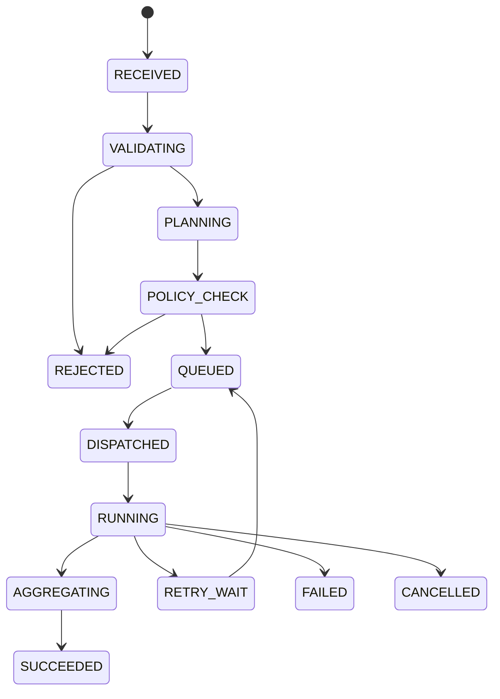

# Control Plane architecture

## State machine

Transitions use compare-and-set on state/version and append a lifecycle event through an outbox. Terminal transitions are monotonic. Each retry creates a new attempt; the task identity is stable.

## Agent and model selection

Agent selection filters registry snapshots by requested skill/capability, supported task schema, enabled version, tenant scope, health and policy. A deterministic score combines locality, current capacity, reliability, priority, and affinity. Selection is pinned for an attempt and auditable.

Model routing applies hard eligibility constraints before scoring: modality, context, tool support, provider/region, classification, budget, and health. Weighted quality, latency, cost, and load choose a model version. Routes include bounded fallback candidates; policy is reevaluated before switching provider or region.

## Policy integration

The evaluator receives principal, roles, tenant, normalized task, proposed agent/model, resource labels, capabilities, environment, and policy-bundle version. `deny` ends admission; `modify` produces a new immutable plan with narrowed tools, paths, network destinations, budgets, or model set. The final grant is signed and bound to the task attempt and Runtime audience.

## Scheduler

Queues are partitioned by tenant and workload class. Weighted fair scheduling applies tenant quotas and priority without starvation. Workers acquire expiring leases with fencing tokens; heartbeats extend leases. Admission accounts for Runtime capability, memory/CPU capacity, affinity, concurrency, and deadlines. Cancellation and deadline expiry revoke the lease and notify Runtime.

## Failure and retry

Errors are classified as validation, policy, transient dependency, provider throttling, runtime infrastructure, tool/application, cancellation, or unknown side-effect. Only declared retry-safe operations retry, using exponential backoff with jitter and per-task budgets. Provider and Runtime circuit breakers prevent retry storms. Exhaustion yields a stable failure reason; uncertain side effects enter reconciliation.

## Persistence

Postgres is authoritative for task state, attempts, leases, registry references, policy/routing decisions, and outbox records. MongoDB stores flexible plan/result documents when relational projection is unsuitable. Redis supplies queues, ephemeral coordination and caches; it is reconstructible. Qdrant stores retrieval vectors and ACL metadata references. MinIO stores immutable large inputs, outputs and logs by content hash. Consumers are idempotent and use event inbox tables/keys.

## Orchestration/execution separation

Control decides *what* may run and records why. Runtime decides *how* to isolate and enforce the already-authorized operation. Control contains no subprocess/shell or host-filesystem execution path. Runtime contains no agent selection, model routing, user RBAC, or business-policy interpretation. Their only shared dependency is the versioned contract and cryptographic grant format.
