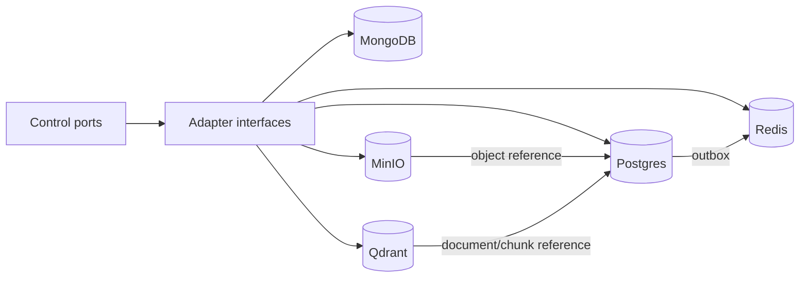

# Data Layer architecture

Domain interfaces use stable models and explicit consistency/timeout options. Vendor adapters translate errors into shared categories, apply tracing, enforce tenant scope, and own connection pools/migrations. Application code receives interfaces through dependency injection.

## Vector search

Ingestion computes a content hash, stores/reuses the object, records document and chunk versions, generates embeddings in bounded batches, and upserts Qdrant points with document/chunk IDs, tenant, ACL, classification, language and embedding-version payload. Publication marks an ingestion version active only after all required writes succeed. Search embeds the normalized query, applies tenant/ACL filters server-side, retrieves top-k, reranks if configured, hydrates authorized sources, and returns citations. Re-embedding writes a new collection/alias version before atomic cutover.

## Caching

Redis uses cache-aside for immutable/versioned reads and short-lived derived responses. Keys include tenant, resource ID, schema/version and policy-relevant dimensions. Writes invalidate or advance versioned keys after authoritative commit. Negative caching is brief; stampede control uses single-flight/leases. Security decisions and mutable task state are not trusted solely from cache.

## Consistency

Postgres transactions provide strong consistency for task state and outbox. Mongo/Qdrant/MinIO projections are eventually consistent and carry source version/content hash. Consumers are idempotent, use conditional versions, and reconcile periodically. Read-your-writes paths use the authoritative store or await a projection watermark. Deletion uses tombstones and retention-aware asynchronous cleanup.

## Schema evolution

Relational migrations are ordered, immutable after release, backward-compatible during rolling deploys, and follow expand/backfill/contract. Mongo documents carry `schema_version` with read adapters/upcasters. Qdrant collections/aliases and embedding versions are immutable migration units. Object metadata includes content type, schema and checksum. Every migration has verification, rollback/forward-fix guidance, and production backup prerequisites.
