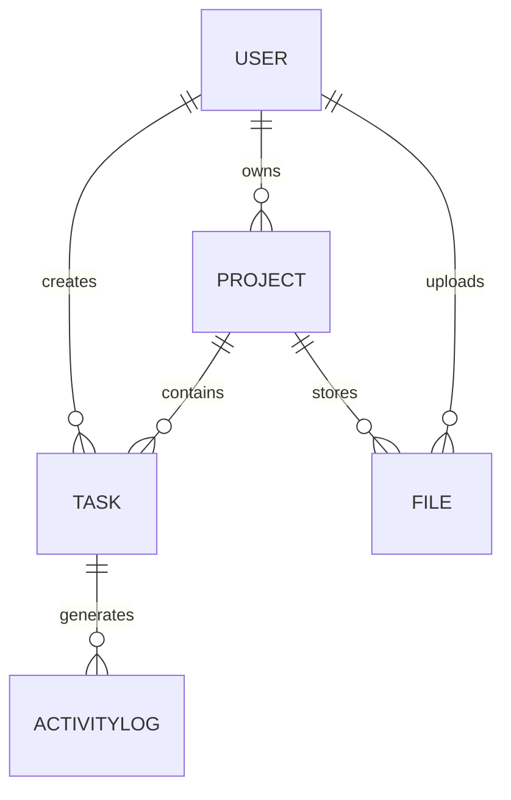

```mermaid
erDiagram
    USER ||--o{ PROJECT : owns
    USER ||--o{ TASK : creates
    PROJECT ||--o{ TASK : contains
    TASK ||--o{ ACTIVITYLOG : generates
    PROJECT ||--o{ FILE : stores
    USER ||--o{ FILE : uploads
```
