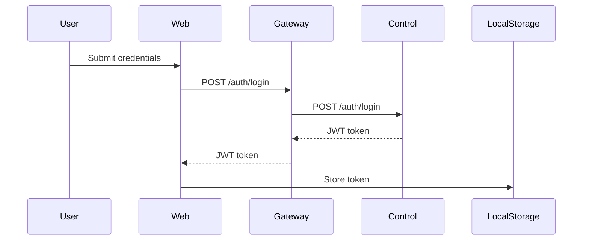
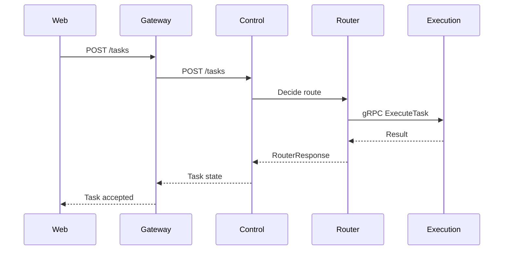
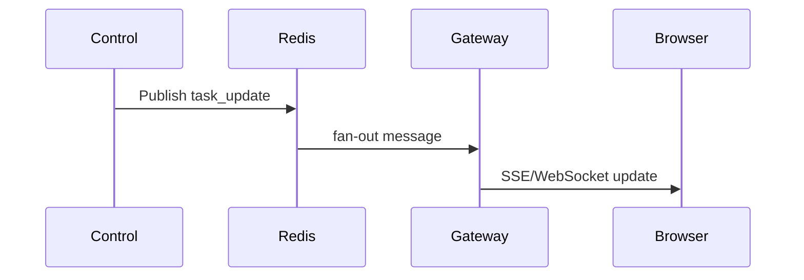

## Login Flow

```mermaid
sequenceDiagram
    participant User
    participant Web
    participant Gateway
    participant Control

    User->>Web: Submit credentials
    Web->>Gateway: POST /auth/login
    Gateway->>Control: POST /auth/login
    Control-->>Gateway: JWT token
    Gateway-->>Web: JWT token
    Web->>LocalStorage: Store token
```

## Create Task

```mermaid
sequenceDiagram
    participant Web
    participant Gateway
    participant Control
    participant Router
    participant Execution

    Web->>Gateway: POST /tasks
    Gateway->>Control: POST /tasks
    Control->>Router: Decide route
    Router->>Execution: gRPC ExecuteTask
    Execution-->>Router: Result
    Router-->>Control: RouterResponse
    Control-->>Gateway: Task state
    Gateway-->>Web: Task accepted
```

## Live Update

```mermaid
sequenceDiagram
    participant Control
    participant Redis
    participant Gateway
    participant Browser

    Control->>Redis: Publish task_update
    Redis->>Gateway: fan-out message
    Gateway->>Browser: SSE/WebSocket update
```
