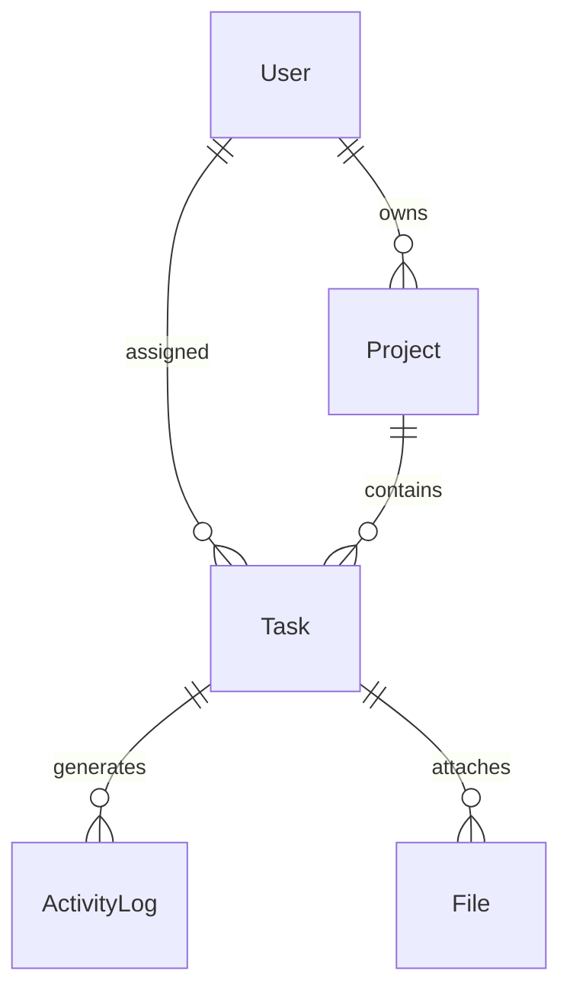
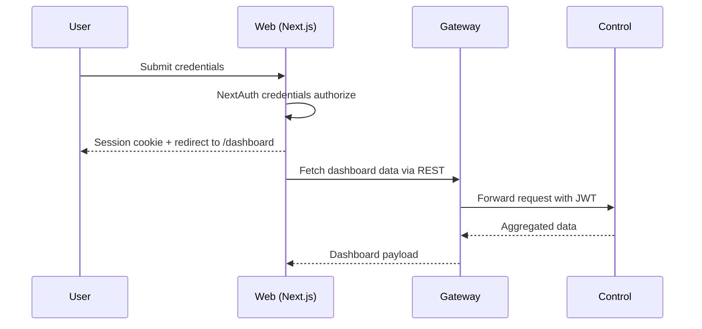
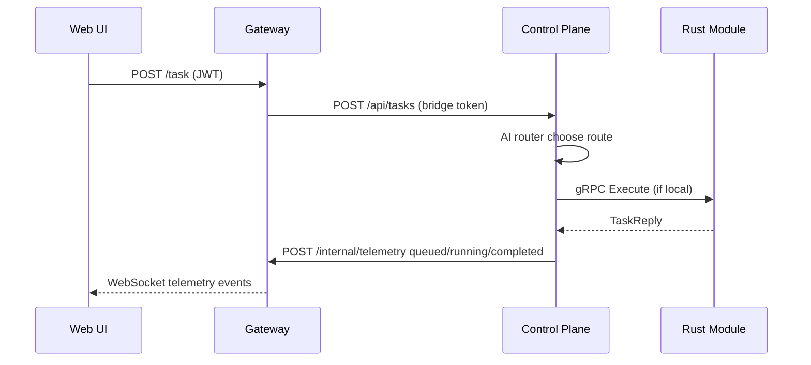

# AION-OS Architecture

## Repository Layout

```
.
├── gateway          # Fastify gateway with WebSocket streaming
├── control          # FastAPI control plane and AI router
├── execution        # Rust gRPC execution modules
├── web              # Next.js glass UI console
├── docker-compose.yml
└── docs
```

## Entity Relationship Diagram



## Sequence Diagram – Login



## Sequence Diagram – Create Task and Live Update



## API Reference

### Gateway
- `POST /task` — forward task payload to control plane
- `GET /ws/stream/{taskId}` — subscribe to telemetry events
- `GET /health` — readiness probe

### Control Plane
- `POST /api/tasks` — create and dispatch tasks via AI router
- `GET /health` — readiness probe

### Web Console
- `GET /api/health` — local status check

## State Maps

### React Query
- `['health']` — gateway/control health check

### Zustand
- `useTelemetryStore` — maintains recent telemetry events (max 25)

## Design Tokens

| Token | Value |
|-------|-------|
| Blur | `backdrop-blur-xl (24px)` |
| Radius | `rounded-glass-lg (24px)` |
| Gradient | `radial gradients in globals.css` |
| Elevation | `shadow-glass` |
| Accent | `#7f5af0` |

## Theming & Accessibility
- Supports dark theme via `next-themes`
- Focus states use visible outlines on inputs/buttons
- Reduced motion respected via CSS media query
- High contrast fallback backgrounds for translucent panels

## Performance
- Async routers and gRPC keep services non-blocking
- React Query caching for expensive calls
- Docker services expose metrics-ready endpoints

## Security
- JWT validated on gateway via Fastify JWT
- Bridge token ensures internal control-plane requests
- NextAuth enforces session strategy with role claim

## Runbook
1. Copy `.env.example` to `.env` and adjust secrets
2. Run `docker compose up --build`
3. For local dev, start services individually (see README)
4. Apply Prisma migrations (not included) and seed via `pnpm dlx prisma db push && pnpm ts-node prisma/seed.ts`
5. Create first admin via seed script or NextAuth credentials
6. Use Web UI to dispatch tasks and observe telemetry
7. Run tests before commits (`pnpm test`, `pytest`, `cargo test`)
