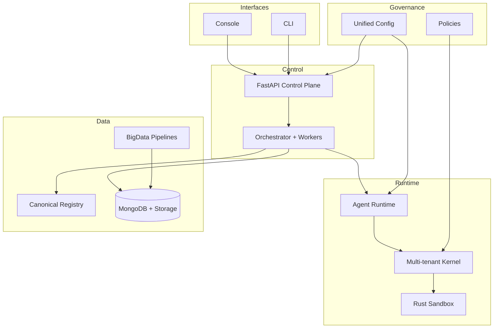

# ARCHITECTURE

## Layered Architecture

```mermaid
flowchart TB
  subgraph Interfaces
    UI[Console]
    CLI[CLI]
  end
  subgraph Control
    API[FastAPI Control Plane]
    Orch[Orchestrator + Workers]
  end
  subgraph Runtime
    Agents[Agent Runtime]
    Kernel[Multi-tenant Kernel]
    Exec[Rust Sandbox]
  end
  subgraph Data
    Registry[Canonical Registry]
    DB[(MongoDB + Storage)]
    BigData[BigData Pipelines]
  end
  subgraph Governance
    Policy[Policies]
    Config[Unified Config]
  end

  UI --> API
  CLI --> API
  API --> Orch --> Agents --> Kernel --> Exec
  Orch --> Registry
  Orch --> DB
  BigData --> DB
  Policy --> Kernel
  Config --> API
  Config --> Agents
```

## Control → Agent → Execution → DB Flow
1. API accepts command/event.
2. Orchestrator resolves registry metadata.
3. Agent runtime composes execution plan.
4. Kernel enforces tenancy/policy boundaries.
5. Rust sandbox executes isolated modules.
6. Results and telemetry persist to DB and analytics streams.

## Registry Resolution Mechanism
- Registry lock and manifests are canonical metadata sources.
- Runtime consumers resolve model/agent identity through registry APIs.
- Version lock guarantees deterministic deployment surfaces.

## Config Abstraction Design
- Config is consumed through a unified loader API.
- Scope-based configuration enables environment and tenant overrides.
- Direct scattered config reads should be progressively removed.

## BigData Separation
- BigData pipelines stay outside control runtime paths.
- Control plane consumes aggregated insights through API/data contracts.

## Multi-tenant Kernel Isolation
- Tenant context is bound at request ingress.
- Kernel enforces policy and resource partitions per tenant.

## Cross-layer Dependency Policy
- Control plane must not depend on CLI internals.
- CLI consumes stable control/core interfaces only.
- Agents never directly parse raw registry files.
- Execution is isolated to `/execution` runtime contracts.
