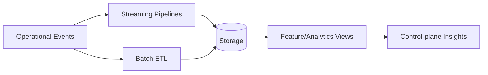

# BIGDATA_PIPELINES

## ETL Flow

## Schema Separation
- Operational schemas are separated from analytics schemas.
- Pipeline contracts provide stable ingestion and query boundaries.

## Data Storage Boundaries
- Control data and analytics data are decoupled.
- BigData jobs should not execute in control-plane request handlers.
