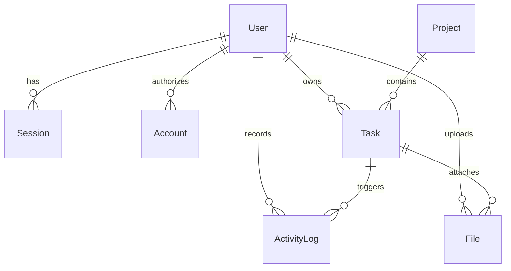

# Entity Relationship Diagram

```mermaid
erDiagram
  User ||--o{ Session : has
  User ||--o{ Account : authorizes
  User ||--o{ Task : owns
  User ||--o{ ActivityLog : records
  User ||--o{ File : uploads
  Project ||--o{ Task : contains
  Task ||--o{ ActivityLog : triggers
  Task ||--o{ File : attaches
```
