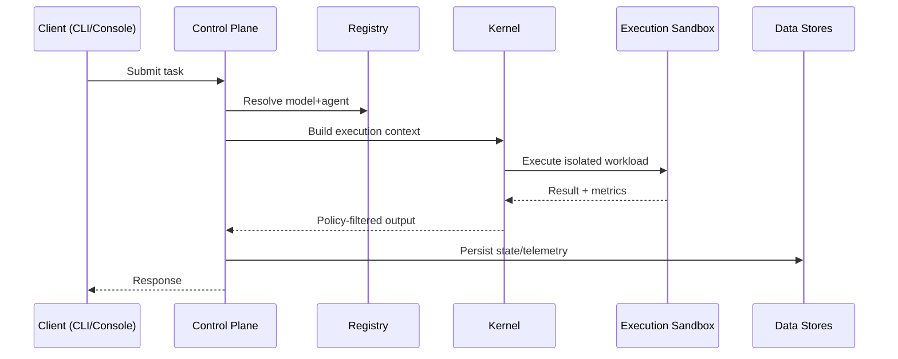

# SYSTEM_DESIGN

## Design Principles
- Deterministic orchestration
- Isolation-first execution
- Policy-driven autonomy
- Deploy-anywhere architecture

## Core Runtime Model

## Reliability and Safety
- Async task workers with retry boundaries
- Health endpoints and metrics surfaces
- Registry lock based reproducibility
- Policy enforcement before execution dispatch
