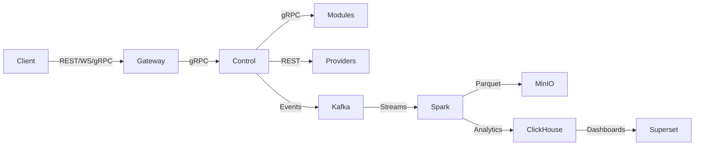
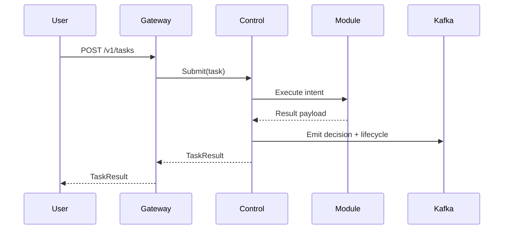
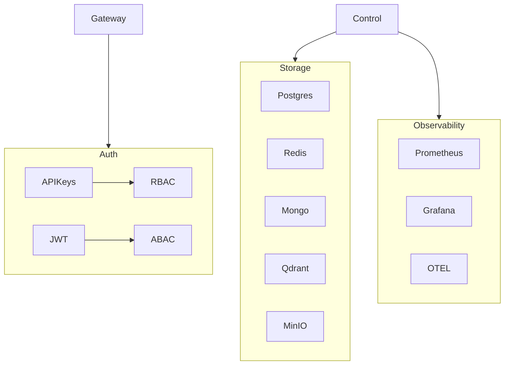

# Architecture

```mermaid
flowchart LR
  Client -->|REST/WS/gRPC| Gateway
  Gateway -->|gRPC| Control
  Control -->|gRPC| Modules
  Control -->|REST| Providers
  Control -->|Events| Kafka
  Kafka -->|Streams| Spark
  Spark -->|Parquet| MinIO
  Spark -->|Analytics| ClickHouse
  ClickHouse -->|Dashboards| Superset
```

```mermaid
sequenceDiagram
  participant U as User
  participant G as Gateway
  participant C as Control
  participant M as Module
  participant K as Kafka

  U->>G: POST /v1/tasks
  G->>C: Submit(task)
  C->>M: Execute intent
  M-->>C: Result payload
  C->>K: Emit decision + lifecycle
  C-->>G: TaskResult
  G-->>U: TaskResult
```

```mermaid
flowchart TD
  subgraph Auth
    APIKeys --> RBAC
    JWT --> ABAC
  end
  subgraph Storage
    Postgres
    Redis
    Mongo
    Qdrant
    MinIO
  end
  subgraph Observability
    Prometheus
    Grafana
    OTEL
  end
  Gateway --> Auth
  Control --> Storage
  Control --> Observability
```
