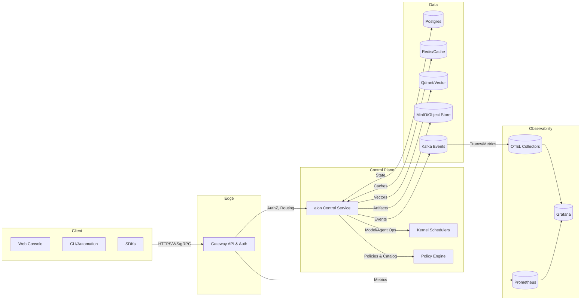
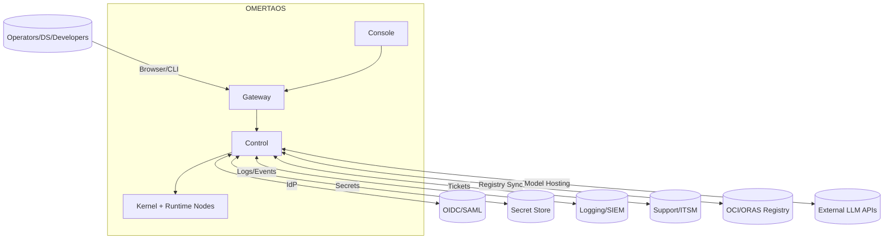
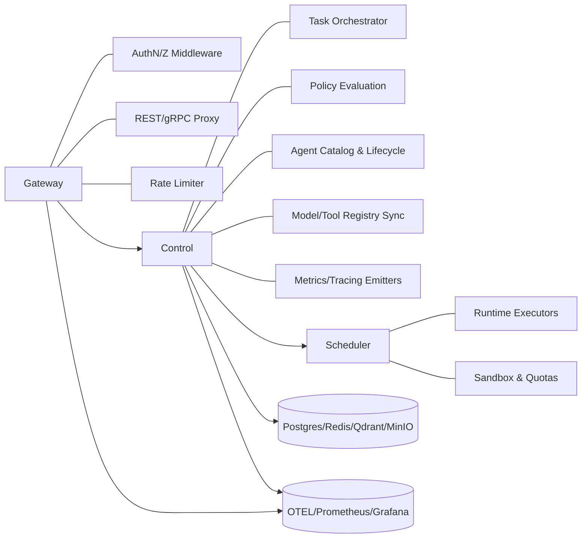
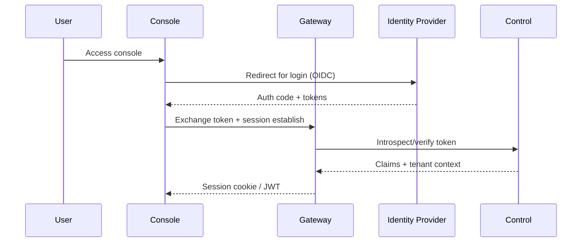
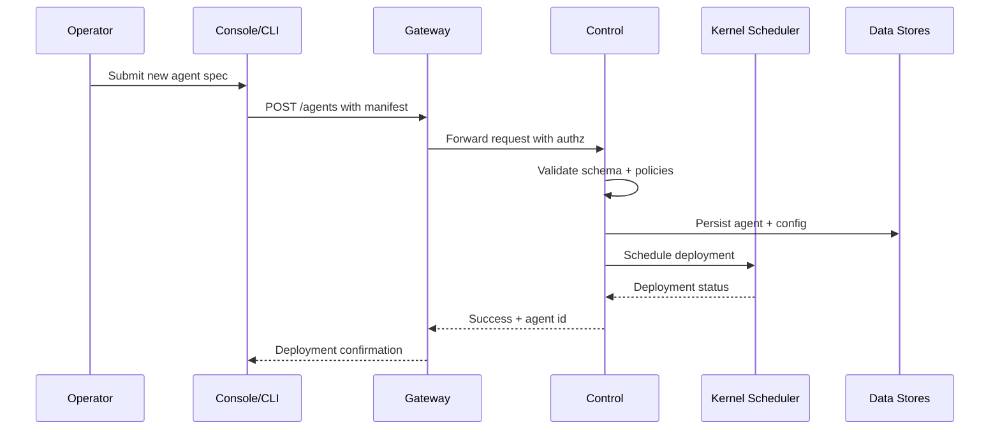
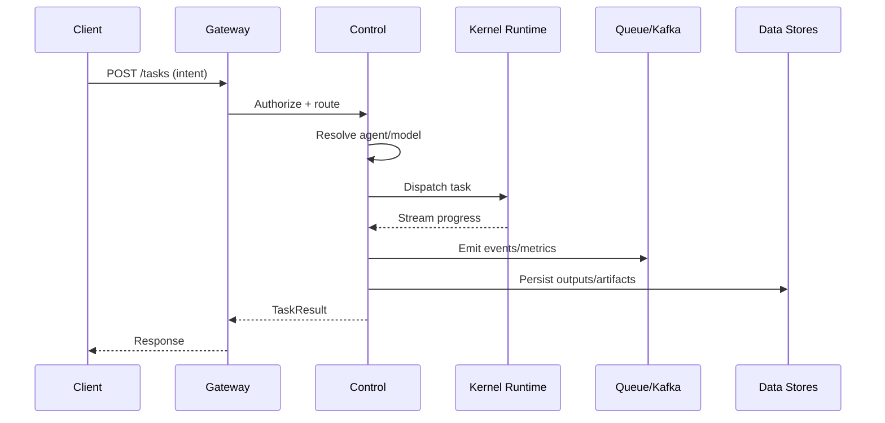
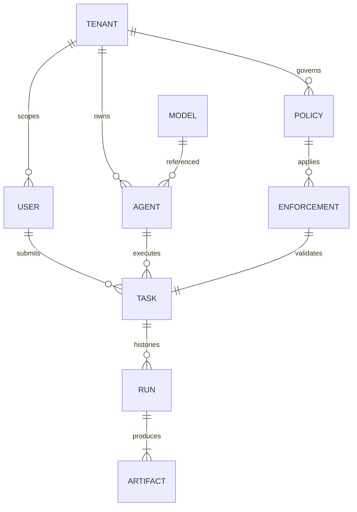

# Architecture & Design

## High-Level Architecture

## Context & Boundaries

## Component / Module Diagram

## Sequence Diagrams
### Login (OIDC)

### Agent Deployment

### Job Execution

## Domain Model / ERD

## Design Patterns
- **Gateway proxy + BFF**: isolates auth/routing and provides console-friendly APIs.
- **Control-plane / data-plane split**: orchestrator delegates execution to kernel runtimes.
- **CQRS-style separation**: read/write paths segregated via caches and event streams.
- **Policy-as-code**: policy engine evaluates manifests and tenant context before actions.
- **Event-driven telemetry**: Kafka/OTEL streams decouple producers from analytics consumers.

## Security Architecture
- **TLS everywhere** with mutual TLS between gateway, control, and runtimes.
- **Authentication** via OIDC/SAML for console; API keys/JWT for service-to-service.
- **Authorization** using RBAC/ABAC tied to tenant context; rate limiting at gateway.
- **Secrets management** delegated to external vault; no secrets stored in code.
- **Data protection**: encryption in transit (TLS) and at rest (KMS-backed storage for Postgres/MinIO); scoped caches per tenant.
- **Auditability**: audit logs for login, policy changes, agent lifecycle, and task execution emitted to SIEM.

## Logging, Metrics, and Tracing
- **Tracing**: OTEL instrumentation in gateway/control publishes spans to collectors.
- **Metrics**: Prometheus scrapes gateway/control/kernel exporters; Grafana dashboards for latency, throughput, and resource use.
- **Logging**: structured JSON logs shipped to centralized log store/SIEM with correlation IDs.
- **Alerting**: SLO-based alerts on error rates, P95 latency, scheduler backlog, and failed policy checks.

## Architecture Decision Records (ADRs)
- **WASM-first strategy** for execution sandboxes (`docs/adr/0001-wasm-first.md`).
- **Kafka requirement** for eventing backbone (`docs/adr/0002-kafka-required.md`).
- **Public gRPC interfaces** to standardize module communication (`docs/adr/0003-public-grpc.md`).
- **Multi-tenant uplift** with tenant-scoped resources and headers (`docs/adr/0004-multi-tenant-uplift.md`).
- **ORAS packaging** for artifacts and manifests (`docs/adr/0005-oras-packaging.md`).
