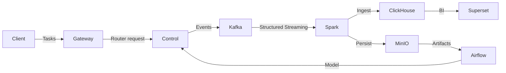
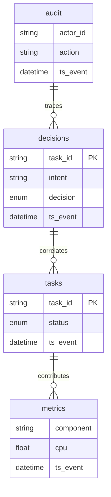
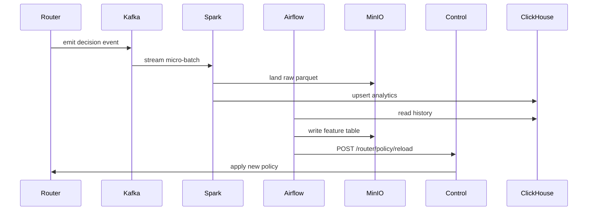

# AION-OS Big Data Extension

## Architecture Overview

## Analytical ERD

## Router Learning Loop Sequence

## Runbook

### Startup
1. `docker compose -f docker-compose.yml -f docker-compose.bigdata.yml up -d`
2. Verify Kafka, Spark, ClickHouse, MinIO, Airflow, Superset, Grafana are healthy.
3. Run `bigdata/scripts/smoke_test.sh` to validate end-to-end ingestion.

### Health Checks
- Kafka: `kafka-consumer-groups --bootstrap-server kafka:9092 --describe`.
- Spark: visit `http://localhost:8080` for driver UI.
- Airflow: `http://localhost:8082` for DAG status.
- MinIO: `mc admin info minio/`.
- ClickHouse: `clickhouse-client --query "SELECT count() FROM aion.decisions"`.

### Lag Handling
- Increase Spark micro-batch interval to reduce load.
- Scale additional Spark workers (set `SPARK_WORKER_CORES`).
- Add Kafka partitions for hot topics.

### Scaling Out
- Deploy additional ClickHouse shards using Kubernetes manifests in `k8s/` (future work).
- Configure Superset worker pods for concurrency.

### Retention & Backups
- Kafka retention configured via `KAFKA_LOG_RETENTION_HOURS` (dev default 72h).
- ClickHouse TTL automatically purges data after 90 days.
- MinIO lifecycle managed by `minio-create-buckets` job.
- Backup MinIO: `mc mirror minio/aion-models s3/backup/aion-models`.
- Backup ClickHouse: `clickhouse-backup create --tables aion.*`.

### Incident Checklist
- Confirm event production using schema compatibility checks.
- Validate Superset dashboards for anomalies.
- Trigger `POST /router/policy/rollback` if new model degrades KPIs.

## Validation Scripts
- `bigdata/scripts/smoke_test.sh`: produces synthetic router decision and asserts ClickHouse ingestion.
- `pytest`: validates schema contracts and policy reload behavior.

## Data Catalog
Metadata YAML files live in `data/catalog/` mirroring Glue concepts for the MinIO lake.
