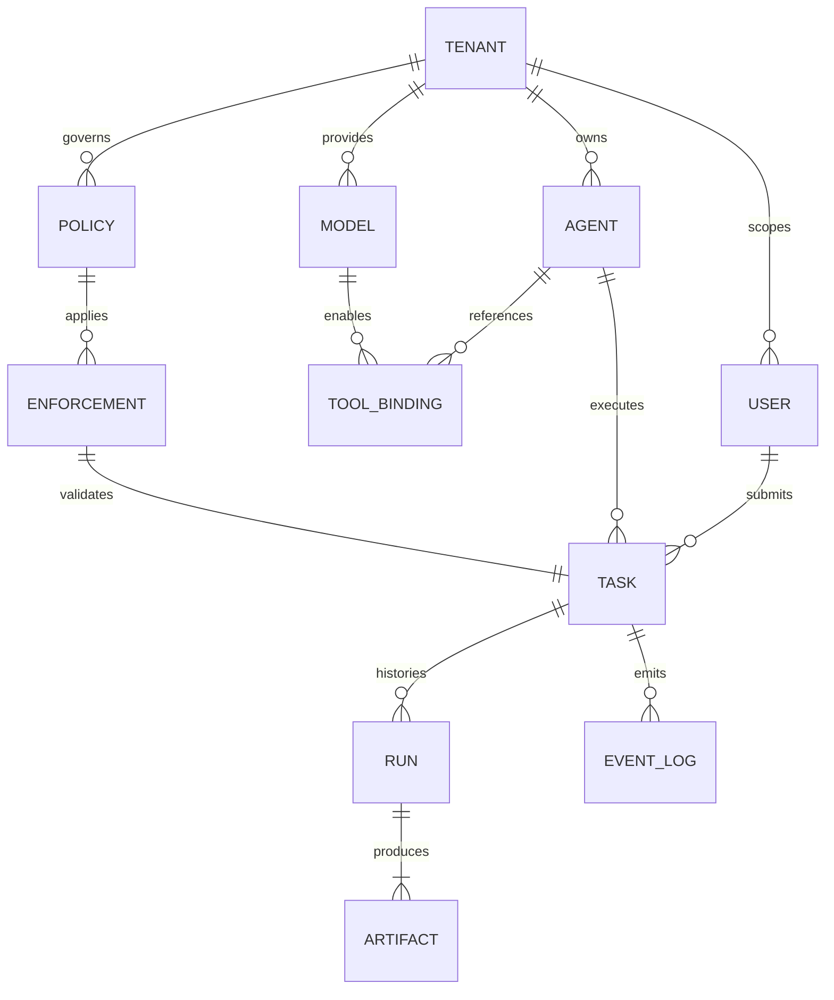

# Data Architecture & Database Design

## 1. Entity-Relationship Diagram (Logical)
- Primary system of record is PostgreSQL for multi-tenant control-plane state; Redis is used for ephemeral caches and queues, Qdrant for vectors, MinIO/S3 for artifacts, and Kafka for events/telemetry.
- Tenancy is enforced on all relational entities through `tenant_id` foreign keys and row-level filters.

## 2. Data Dictionary (Relational + Auxiliary Stores)
### Tenants
| Column | Type | Null | Default | Description |
| --- | --- | --- | --- | --- |
| id | uuid (PK) | No | gen_random_uuid() | Tenant identifier and shard key |
| name | text | No |  | Display name |
| slug | text | No |  | URL-safe unique slug |
| tier | text | No | 'standard' | License/tier (standard/pro/enterprise) |
| settings | jsonb | Yes | '{}'::jsonb | Tenant-wide flags (feature toggles, quotas) |
| created_at | timestamptz | No | now() | Creation timestamp |
| updated_at | timestamptz | No | now() | Last update |

**Indexes/Constraints:** PK on `id`; unique index on `slug`; GIN on `settings` for key lookup. Row estimates: tens to low hundreds.

### Users
| Column | Type | Null | Default | Description |
| --- | --- | --- | --- | --- |
| id | uuid (PK) | No | gen_random_uuid() | User id |
| tenant_id | uuid (FK -> tenants.id) | No |  | Tenant scope |
| external_id | text | No |  | IdP subject/handle |
| email | citext | No |  | Unique per tenant |
| display_name | text | Yes |  | Friendly name |
| roles | text[] | No | '{}'::text[] | RBAC roles |
| last_login_at | timestamptz | Yes |  | Last login timestamp |
| created_at | timestamptz | No | now() | Creation |
| updated_at | timestamptz | No | now() | Update |

**Indexes/Constraints:** PK on `id`; unique (tenant_id, email); btree on `external_id`; GIN on `roles` for membership queries.

### Agents
| Column | Type | Null | Default | Description |
| --- | --- | --- | --- | --- |
| id | uuid (PK) | No | gen_random_uuid() | Agent id |
| tenant_id | uuid (FK -> tenants.id) | No |  | Tenant scope |
| name | text | No |  | Agent display name |
| slug | text | No |  | Unique per tenant |
| status | text | No | 'draft' | draft/active/disabled |
| spec | jsonb | No |  | Agent manifest including tools, models |
| version | integer | No | 1 | Monotonic version |
| created_by | uuid (FK -> users.id) | Yes |  | Creator |
| created_at | timestamptz | No | now() | Creation |
| updated_at | timestamptz | No | now() | Update |

**Indexes/Constraints:** PK on `id`; unique (tenant_id, slug); GIN on `spec`; partial index on (tenant_id) where status='active' to speed listings.

### Models
| Column | Type | Null | Default | Description |
| --- | --- | --- | --- | --- |
| id | uuid (PK) | No | gen_random_uuid() | Model id |
| tenant_id | uuid (FK -> tenants.id) | Yes |  | Null for shared/global models |
| name | text | No |  | Model name |
| provider | text | No |  | e.g., openai, hf, onnx |
| manifest | jsonb | No |  | Resolver info, endpoints, credentials ref |
| tags | text[] | Yes |  | Capabilities/versions |
| created_at | timestamptz | No | now() | Creation |
| updated_at | timestamptz | No | now() | Update |

**Indexes/Constraints:** PK on `id`; unique (tenant_id, name) allowing null tenant; GIN on `tags`.

### Tasks
| Column | Type | Null | Default | Description |
| --- | --- | --- | --- | --- |
| id | uuid (PK) | No | gen_random_uuid() | Task id |
| tenant_id | uuid (FK -> tenants.id) | No |  | Tenant |
| agent_id | uuid (FK -> agents.id) | No |  | Target agent |
| user_id | uuid (FK -> users.id) | Yes |  | Requestor |
| status | text | No | 'queued' | queued/running/succeeded/failed/cancelled |
| input | jsonb | Yes |  | Task input/prompt |
| output | jsonb | Yes |  | Final output |
| error | jsonb | Yes |  | Error payload |
| scheduled_at | timestamptz | Yes |  | When queued |
| started_at | timestamptz | Yes |  | When running |
| completed_at | timestamptz | Yes |  | When finished |
| trace_id | text | Yes |  | Correlation id |
| created_at | timestamptz | No | now() | Creation |
| updated_at | timestamptz | No | now() | Update |

**Indexes/Constraints:** PK on `id`; btree on (tenant_id, agent_id); btree on status; BRIN on scheduled_at/created_at for time scans; partial index where status in ('queued','running').

### Runs
| Column | Type | Null | Default | Description |
| --- | --- | --- | --- | --- |
| id | uuid (PK) | No | gen_random_uuid() | Run attempt |
| task_id | uuid (FK -> tasks.id) | No |  | Parent task |
| kernel_node | text | Yes |  | Worker executing |
| latency_ms | integer | Yes |  | Duration |
| cost | numeric(18,6) | Yes | 0 | Cost estimate |
| telemetry | jsonb | Yes |  | Execution metrics |
| created_at | timestamptz | No | now() | Start time |

**Indexes/Constraints:** PK on `id`; btree on task_id; btree on created_at.

### Artifacts (object store metadata)
| Column | Type | Null | Default | Description |
| --- | --- | --- | --- | --- |
| id | uuid (PK) | No | gen_random_uuid() | Artifact id |
| run_id | uuid (FK -> runs.id) | No |  | Producing run |
| tenant_id | uuid (FK -> tenants.id) | No |  | Tenant |
| uri | text | No |  | Object store URI (MinIO/S3) |
| kind | text | No |  | log/output/checkpoint |
| size_bytes | bigint | Yes |  | Payload size |
| checksum | text | Yes |  | Integrity hash |
| created_at | timestamptz | No | now() | Stored time |

**Indexes/Constraints:** PK on `id`; btree on run_id; btree on tenant_id; btree on (kind, created_at).

### Policies & Enforcements
| Column | Type | Null | Default | Description |
| --- | --- | --- | --- | --- |
| id | uuid (PK) | No | gen_random_uuid() | Policy id |
| tenant_id | uuid (FK -> tenants.id) | No |  | Tenant |
| name | text | No |  | Policy name |
| version | integer | No | 1 | Version |
| definition | jsonb | No |  | CEL/OPA/rego style rules |
| status | text | No | 'active' | active/disabled |
| created_at | timestamptz | No | now() | Creation |
| updated_at | timestamptz | No | now() | Update |

| Column | Type | Null | Default | Description |
| --- | --- | --- | --- | --- |
| id | uuid (PK) | No | gen_random_uuid() | Enforcement id |
| policy_id | uuid (FK -> policies.id) | No |  | Policy |
| task_id | uuid (FK -> tasks.id) | No |  | Checked task |
| outcome | text | No |  | allow/deny/warn |
| details | jsonb | Yes |  | Evaluation details |
| created_at | timestamptz | No | now() | Timestamp |

**Indexes/Constraints:** PKs on ids; btree on (policy_id, created_at); btree on (task_id, outcome).

### Tool Bindings
| Column | Type | Null | Default | Description |
| --- | --- | --- | --- | --- |
| id | uuid (PK) | No | gen_random_uuid() | Binding id |
| agent_id | uuid (FK -> agents.id) | No |  | Agent |
| model_id | uuid (FK -> models.id) | Yes |  | Model tied to tool |
| name | text | No |  | Tool name |
| spec | jsonb | No |  | Tool schema/config |
| created_at | timestamptz | No | now() | Creation |

**Indexes/Constraints:** PK on `id`; btree on (agent_id, name); GIN on `spec`.

### Event Logs (append-only)
| Column | Type | Null | Default | Description |
| --- | --- | --- | --- | --- |
| id | bigserial (PK) | No |  | Event id |
| tenant_id | uuid (FK -> tenants.id) | No |  | Tenant |
| task_id | uuid (FK -> tasks.id) | Yes |  | Related task |
| actor | text | Yes |  | Source (agent/gateway/kernel) |
| level | text | No | 'info' | log level |
| message | text | No |  | Message |
| payload | jsonb | Yes |  | Structured data |
| created_at | timestamptz | No | now() | Event time |

**Indexes/Constraints:** PK on `id`; BRIN on created_at; btree on (tenant_id, task_id).

### Auxiliary Stores
- **Redis**: task queues, rate-limit counters, short-lived session caches; TTL-driven, no persistence required beyond 24h.
- **Qdrant (Vectors)**: collections per tenant/agent for embeddings; primary keys are deterministic UUIDs; metadata includes task_id, tenant_id, model, tool.
- **MinIO/S3**: artifacts and logs; bucket naming convention `tenant-slug-env`; server-side encryption (SSE-S3/KMS) enabled.
- **Kafka**: topics for task events, metrics, audit; partitioned by tenant_id for ordering within tenant.

## 3. Indexing & Performance Strategy
- **Workload characteristics:** write-heavy on tasks/runs, read-heavy on agent catalog and policies; time-series access for events.
- **Indexes:** targeted btree/GIN/BRIN indexes as noted per table; avoid over-indexing jsonb; use partial indexes on active tasks and enabled policies.
- **Partitioning:**
  - PostgreSQL: range partitioning on `event_logs.created_at` by month; optional partitioning on `tasks` by `created_at` when daily volume >1M.
  - Kafka: partitions keyed by `tenant_id` to preserve ordering; retention aligned with policy.
- **Caching:** Redis for hot agent metadata and policy decisions (TTL 5–10 minutes) to reduce database reads.
- **Read replicas:** optional Postgres read replicas for analytics/dashboard queries; control-plane writes always target primary.
- **Growth management:** BRIN indexes on append-only tables; periodic VACUUM/ANALYZE; archive cold artifacts to cheaper object storage tier.

## 4. Backup & Restore Policy
| Data Store | Backup Type | Frequency | Retention | RPO | RTO | Notes |
| --- | --- | --- | --- | --- | --- | --- |
| PostgreSQL | Full + WAL shipping | Full daily, WAL every 15 min | 30 days | ≤15 min | ≤4 hours | Point-in-time recovery via WAL; test restores monthly |
| Redis | Not backed up (ephemeral) | N/A | N/A | N/A | N/A | Stateless caches reconstructed |
| Qdrant | Snapshot + object backup | Daily snapshot | 14 days | ≤24 hours | ≤8 hours | Store snapshots in object storage |
| MinIO/S3 | Versioned bucket replication | Continuous | 90 days current, 365-day archive | ≤1 hour | ≤8 hours | Cross-region replication for DR |
| Kafka | Topic retention | 7–30 days configurable | 30 days max | ≤1 hour | ≤2 hours | MirrorMaker/replication for HA |

**Restore procedures:** documented runbook: provision standby, restore latest full backup, apply WALs, validate counts/hashes, re-enable writers; DR uses secondary region replicas with DNS/connection string failover.

## 5. Retention Policy & Data Lifecycle
| Data Class | Live | Near-Line | Archive | Deletion | Notes |
| --- | --- | --- | --- | --- | --- |
| Tasks & Runs | 90 days hot in Postgres | 180 days in warm partition | 1 year in cold store/export | Purge after 18 months | Summaries retained for analytics |
| Event Logs | 30 days hot | 90 days warm | 1 year archive | Delete after 13 months | Privacy-safe; redact PII |
| Artifacts | 90 days in primary bucket | 180 days infrequent-access | 3 years glacier/archive | Delete after 3 years | Hashes retained for audit even after delete |
| Policies/Agents/Models | Current + previous version retained | N/A | N/A | Never auto-deleted | Manual cleanup only |
| Redis caches | ≤24h TTL | N/A | N/A | Expire | No backups |

Privacy/compliance: encrypt data at rest (Postgres TDE/disk encryption; SSE for object storage); TLS in transit; PII minimization in logs; GDPR deletion workflows remove user-linked tasks/artifacts; audit trails preserved with pseudonymization.

## 6. Migration Strategy
- **Tooling:** Prefer Alembic (Python) for PostgreSQL schema migrations with versioned scripts; Terraform/Helm for infra changes; custom Python/SQL scripts for one-off backfills.
- **Approach:** phased/zero-downtime where possible—additive migrations (new columns nullable, backfill, then enforce); use view compatibility for API versions.
- **Rollback:** maintain down revisions; in failure, apply down migration, restore from last backup if data corruption detected, and disable writers during rollback.
- **Data validation:** row counts before/after, checksums on critical tables, sample-based diffing on tasks/runs, and application smoke tests post-migration.
- **Change management:** migrations reviewed and approved by Data/Platform owners; executed during maintenance windows with runbooks and alerting; success criteria logged in change tickets.
