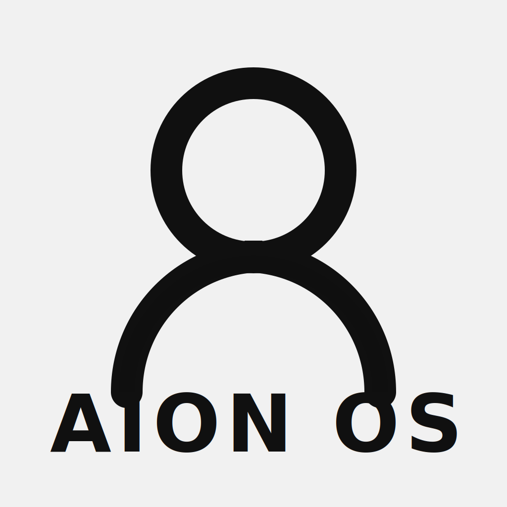

# aionOS Brand Mark

## Usage Guidelines

- **Primary colors:** Black logomark (#101010) on light neutral background (#F1F1F1).
- **Clear space:** Keep at least the width of the circular stroke around the symbol free of other elements.
- **Scaling:** Render as SVG wherever possible. For raster exports, preserve a minimum size of 128×128 px to maintain stroke legibility.
- **Typography:** The wordmark uses a bold geometric sans-serif in uppercase (“AION OS”). When substituting fonts, prefer Helvetica Neue, Arial, or other clean grotesques.

The SVG source lives in [`docs/assets/aion-os-logo.svg`](assets/aion-os-logo.svg) for direct embedding in documentation or product surfaces.
