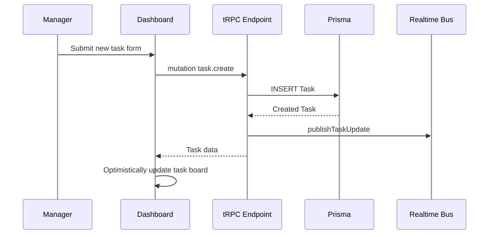

# Sequence Diagram – Create Task

```mermaid
sequenceDiagram
  participant U as Manager
  participant UI as Dashboard
  participant TRPC as tRPC Endpoint
  participant DB as Prisma
  participant RT as Realtime Bus

  U->>UI: Submit new task form
  UI->>TRPC: mutation task.create
  TRPC->>DB: INSERT Task
  DB-->>TRPC: Created Task
  TRPC->>RT: publishTaskUpdate
  TRPC-->>UI: Task data
  UI->>UI: Optimistically update task board
```
