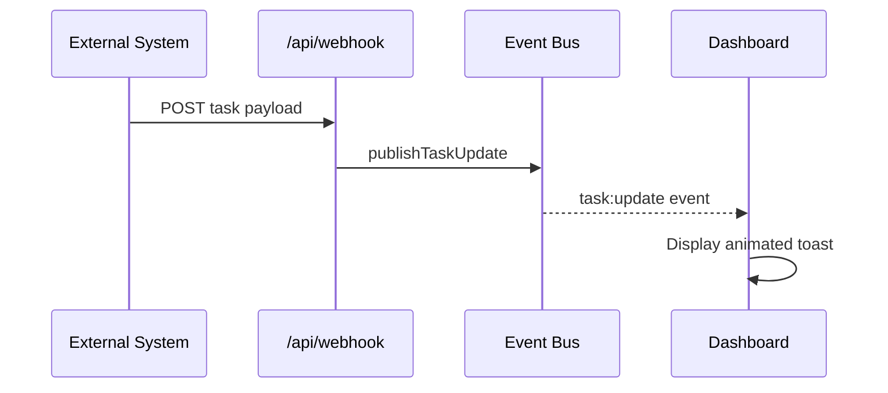

# Sequence Diagram – Live Update

```mermaid
sequenceDiagram
  participant Worker as External System
  participant Webhook as /api/webhook
  participant RT as Event Bus
  participant UI as Dashboard

  Worker->>Webhook: POST task payload
  Webhook->>RT: publishTaskUpdate
  RT-->>UI: task:update event
  UI->>UI: Display animated toast
```
