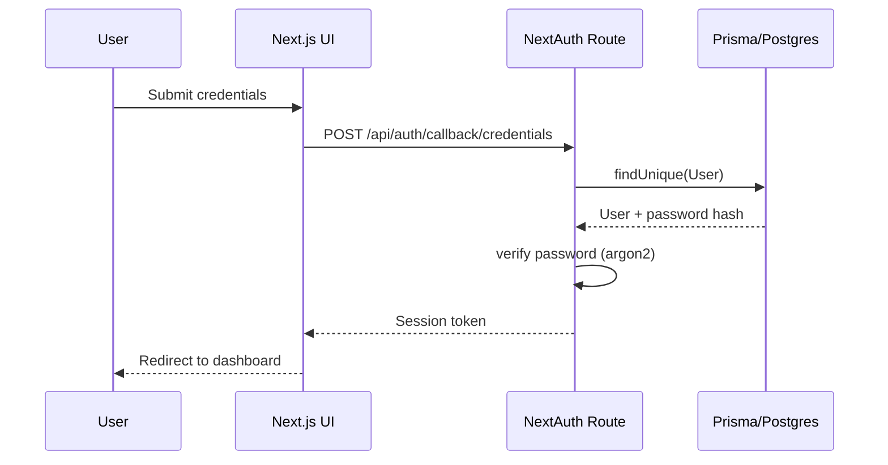

# Sequence Diagram – Login

```mermaid
sequenceDiagram
  participant U as User
  participant UI as Next.js UI
  participant API as NextAuth Route
  participant DB as Prisma/Postgres

  U->>UI: Submit credentials
  UI->>API: POST /api/auth/callback/credentials
  API->>DB: findUnique(User)
  DB-->>API: User + password hash
  API->>API: verify password (argon2)
  API-->>UI: Session token
  UI-->>U: Redirect to dashboard
```
