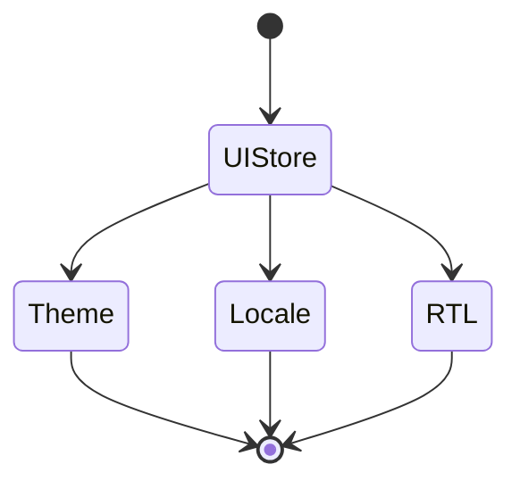
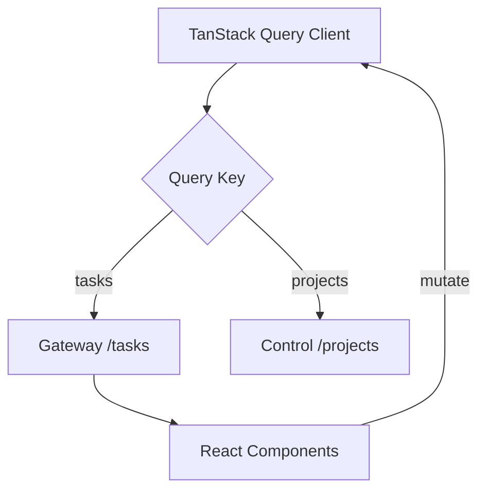

# State Maps

```mermaid
stateDiagram-v2
    [*] --> UIStore
    UIStore --> Theme
    UIStore --> Locale
    UIStore --> RTL
    Theme --> [*]
    Locale --> [*]
    RTL --> [*]
```

```mermaid
flowchart TD
    A[TanStack Query Client] --> B{Query Key}
    B -->|"tasks"| C[Gateway /tasks]
    B -->|"projects"| D[Control /projects]
    C --> E[React Components]
    E -->|mutate| A
```
