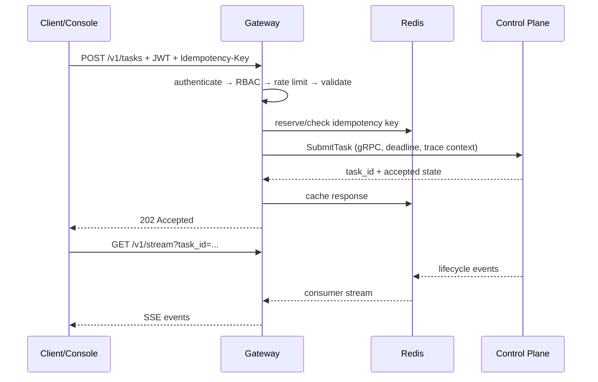

# Gateway service

The Gateway is the Fastify-based external API boundary for OMERTAOS. It authenticates principals, enforces RBAC and admission limits, validates requests, normalizes correlation/idempotency metadata, routes calls to Control, and exposes task events over SSE or WebSocket. It does not plan tasks or execute tools.

## API surface

| Route | Purpose |
|---|---|
| `/v1/tasks` | Submit, inspect, cancel, and list tasks |
| `/v1/agents` | Query authorized agent registry views |
| `/v1/models` | Query authorized model registry views |
| `/v1/stream` | SSE/WebSocket task and system event delivery |

Schemas are owned by `../schemas`; malformed or oversized input is rejected before backend calls. Gateway-to-Control uses generated gRPC clients with deadlines. Temporary compatibility HTTP routes must remain explicit and may not become the primary internal contract.



Redis holds rate-limit counters, short-lived idempotency records, small safe response caches, stream cursors, and distributed coordination keys. It is not the task system of record. Keys are tenant-scoped and TTL-bound; idempotency stores the request digest so key reuse with a different body is rejected.

## Security

JWT signatures, issuer/audience/expiry, API keys where enabled, and optional request signatures are verified at ingress. RBAC gates route actions; Control performs resource/context policy. Production requires TLS, preferably mTLS for service traffic, explicit CORS origins, rotated secrets, payload limits, replay windows for signed requests, and sanitized errors. Forward only signed identity context, never client-supplied role headers.

## Environment

| Variable | Meaning | Typical value |
|---|---|---|
| `AION_GATEWAY_HOST`, `AION_GATEWAY_PORT` | Listener | `0.0.0.0`, `8080` |
| `AION_CONTROL_GRPC` | Control gRPC target | `control:50051` |
| `AION_REDIS_URL` | Cache/coordination | `redis://redis:6379/0` |
| `AION_JWT_PUBLIC_KEY` / `AION_JWT_SECRET_PATH` | JWT verification material | secret-managed |
| `AION_GATEWAY_API_KEYS` | Development API-key map | unset in production |
| `AION_RATE_LIMIT_MAX`, `AION_RATE_LIMIT_WINDOW`, `AION_RATE_LIMIT_PER_IP` | Quotas | deployment-specific |
| `AION_IDEMPOTENCY_TTL` | Idempotency retention seconds | `900` |
| `AION_CORS_ORIGINS` | Allowed browser origins | explicit list |
| `AION_TLS_REQUIRED`, `AION_TLS_REQUIRE_MTLS` | Transport enforcement | `true` in production |
| `AION_OTEL_ENABLED`, `AION_SERVICE_NAME` | Telemetry | `true`, `omertaos-gateway` |

## Local Docker run

From the repository root, start the supported dependency graph:

```bash
docker compose -f docker-compose.quickstart.yml up --build gateway
curl http://localhost:8080/health
```

The Compose service supplies Control and Redis addresses. Running the container alone requires an existing Docker network and those services.
