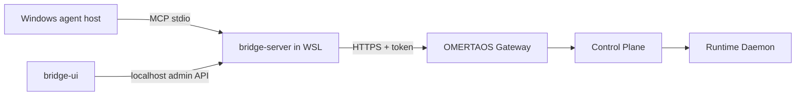

# Windows Agentic Bridge

Canonical owner: `integrations/windows-agentic-bridge/`. The matching tree under
`execution/` is a protected compatibility mirror until S5 and must not be used
for new development or operator commands.

The Windows Agentic Bridge connects Windows agent hosts to OMERTAOS without exposing internal Control or Runtime interfaces. `bridge-server/` is a TypeScript MCP server, normally hosted in WSL and launched by Windows/ODR; `bridge-ui/` is a Vite/React local administration UI for connection status, configuration, tool exposure and logs.



MCP tools translate validated calls such as task submission, task status, agent listing and health into Gateway API operations. The pipeline is host tool call → MCP schema validation → local authorization/tool allowlist → Gateway authentication → OMERTAOS policy and execution → bounded result mapping. Long-running work returns task identity and is polled/streamed; it does not block stdio indefinitely.

The bridge executes no arbitrary local Windows operation by default. Any local tool is independently allowlisted, schema-constrained, user/host authorized, time-limited, and audited. Bind UI/admin endpoints to loopback, protect them with a local credential, restrict the ODR manifest and configuration file ACLs, store tokens outside manifests/logs, verify WSL command paths, pin dependencies, and never forward Control/Runtime ports. OMERTAOS policy remains authoritative.

Local execution uses the bridge process identity and a minimal environment. Subprocess tools require fixed executables/arguments or strict structured translation; shell-string interpolation is prohibited. Cancellation must terminate descendants and output must be size-limited.

Structured logs include timestamp, level, bridge/tool version, invocation/correlation ID, tool name, duration and outcome while redacting tokens, prompts and sensitive arguments. Health covers MCP transport, configuration validity and Gateway reachability. Metrics should cover calls, errors, latency, active work and reconnects.

## Setup

```bash
cd integrations/windows-agentic-bridge/bridge-server
npm install
cp .env.example .env
npm run build
node dist/index.js
```

Build/start `bridge-ui/` with its package scripts. Register `manifests/omertaos-wsl.mcp.json` using `scripts/register-odr.ps1`. Detailed WSL, Windows and security procedures are under `docs/`.
