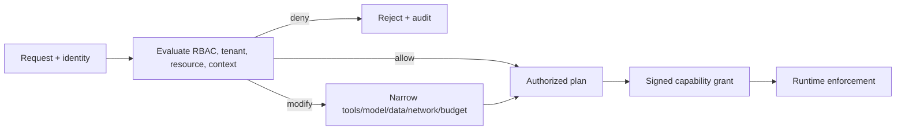

# Policy system

**Document role:** policy architecture and enforcement target. Current policy
files and evaluators are prototype evidence; the full signed-grant flow and
Runtime enforcement are not yet production-validated.

OMERTAOS combines role-based access control (RBAC) with capability-based access control (CBAC). RBAC authorizes a principal to request an API action. Contextual policy evaluates the concrete task and resources. CBAC turns an allowed plan into a short-lived, least-privilege execution grant.

Enforcement is defense in depth:

- Gateway verifies identity, route RBAC, quotas, signatures and request shape.
- Control evaluates task/agent/model/data policy, applies modifications, records the policy bundle and decision, and mints the grant.
- Runtime verifies and enforces executable, filesystem, object, network, secret, device, resource and time capabilities; it cannot broaden a grant.

Policy inputs are normalized and versioned: subject/service identity, roles, tenant, action, resource labels, task/agent/model metadata, data classification, environment, time and risk signals. Outputs are `allow`, `deny`, or `modify`, with stable reason codes and obligations. Default is deny; missing/failed policy evaluation fails closed for protected actions.

Rules and bundles in this directory are the human-authored source of truth. Changes require review, deterministic tests, signed releases, staged rollout, and audit of bundle hash/version. Policies must not contain secrets, depend on mutable wall-clock/network calls without controlled inputs, or log sensitive payloads.
